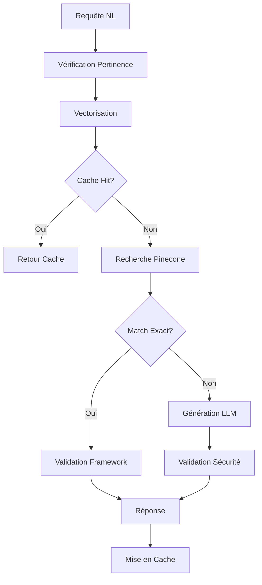

# 🚀 NL2SQL API

<div align="center">


[](https://fastapi.tiangolo.com/)
[](https://openai.com/)
[](https://www.pinecone.io/)
[](https://www.python.org/)
[](https://www.docker.com/)
[](https://opensource.org/licenses/MIT)

_API intelligente qui traduit vos questions en langage naturel en requêtes SQL optimisées avec recherche vectorielle sémantique et support multi-LLM_

[🚀 Installation](#-installation) • [💻 Utilisation](#-utilisation) • [🛡️ Sécurité](#%EF%B8%8F-architecture-de-sécurité) • [⚙️ Configuration](#%EF%B8%8F-configuration) • [❓ FAQ](#-faq)

</div>

---

## ✨ Fonctionnalités Clés

- 🧠 **Multi-LLM** - Support OpenAI (GPT-4), Anthropic (Claude), Google (Gemini)
- 🔍 **Recherche Sémantique** - Utilise Pinecone pour trouver des requêtes similaires
- 🛡️ **Sécurité Renforcée** - Framework obligatoire avec filtres utilisateur automatiques
- ⚡ **Cache Intelligent** - Redis avec contrôle granulaire par requête
- 📋 **Validation Avancée** - Vérification de syntaxe, sécurité et conformité
- 📚 **Documentation Interactive** - Swagger UI et ReDoc intégrés
- 🐳 **Conteneurisé** - Déploiement avec Docker et Docker Compose
- 🔧 **Configurable** - Variables d'environnement pour tous les paramètres
- 📊 **Monitoring** - Métriques de performance et logs détaillés

## 🏗️ Architecture



## 🚀 Installation

### Prérequis

- Python 3.8+
- Clés API pour au moins un LLM provider
- Clé API Pinecone
- Redis (optionnel, pour le cache)
- Docker & Docker Compose (optionnel)

### 🔧 Installation Standard

1. **Cloner le repository**
   ```bash
   git clone https://github.com/datasulting/nl2sql-api.git
   cd nl2sql-api
   ```

2. **Créer l'environnement virtuel**
   ```bash
   python -m venv venv
   source venv/bin/activate  # Linux/macOS
   venv\Scripts\activate     # Windows
   ```

3. **Installer les dépendances**
   ```bash
   pip install -r requirements.txt
   ```

4. **Configuration**
   ```bash
   cp .env.example .env
   ```
   
   Éditez `.env` avec vos clés API :
   ```env
   # Obligatoire
   PINECONE_API_KEY=your_key_here
   OPENAI_API_KEY=your_key_here
   
   # Optionnel pour multi-LLM
   ANTHROPIC_API_KEY=your_key_here
   GOOGLE_API_KEY=your_key_here
   
   # Configuration base
   PINECONE_INDEX_NAME=nl2sql-index
   DEFAULT_PROVIDER=openai
   ```

5. **Ajouter votre schéma**
   ```bash
   mkdir -p app/schemas
   # Copier votre fichier de schéma SQL/Markdown
   cp your-schema.sql app/schemas/
   ```

6. **Lancer l'application**
   ```bash
   python -m app.main
   ```

### 🐳 Installation avec Docker

1. **Préparer la configuration**
   ```bash
   git clone https://github.com/datasulting/nl2sql-api.git
   cd nl2sql-api
   cp .env.example .env
   # Éditer .env avec vos clés
   ```

2. **Lancer avec Docker Compose**
   ```bash
   docker-compose up -d
   ```

L'API sera accessible sur http://localhost:8000

## 💻 Utilisation

### 📖 Documentation Interactive

- **Swagger UI** : http://localhost:8000/docs
- **ReDoc** : http://localhost:8000/redoc

### 🔄 Endpoint Principal : `/api/v1/translate`

```bash
curl -X POST "http://localhost:8000/api/v1/translate" \
  -H "Content-Type: application/json" \
  -H "X-API-Key: your_api_key" \
  -d '{
    "query": "Liste des employés en CDI embauchés en 2023",
    "provider": "openai",
    "model": "gpt-4o",
    "explain": true,
    "use_cache": true
  }'
```

### 📋 Paramètres Disponibles

| Paramètre | Type | Défaut | Description |
|-----------|------|--------|-------------|
| `query` | string | **requis** | Question en langage naturel |
| `provider` | string | `openai` | LLM à utiliser (`openai`, `anthropic`, `google`) |
| `model` | string | auto | Modèle spécifique (ex: `gpt-4o`, `claude-3-opus-20240229`) |
| `validate` | boolean | `true` | Valider la requête SQL générée |
| `explain` | boolean | `true` | Fournir une explication |
| `use_cache` | boolean | `true` | Utiliser le cache Redis |
| `include_similar_details` | boolean | `false` | Inclure les détails des vecteurs similaires |

### 🎯 Exemples d'Utilisation

<details>
<summary><b>Exemple avec Python</b></summary>

```python
import requests

url = "http://localhost:8000/api/v1/translate"
headers = {
    "Content-Type": "application/json",
    "X-API-Key": "your_api_key"
}

# Requête simple
response = requests.post(url, headers=headers, json={
    "query": "Combien d'employés en CDI ?",
    "provider": "openai"
})

result = response.json()
print(f"SQL: {result['sql']}")
print(f"Explication: {result['explanation']}")

# Requête avancée avec cache désactivé
response = requests.post(url, headers=headers, json={
    "query": "Top 10 des salaires les plus élevés en 2023",
    "provider": "anthropic",
    "model": "claude-3-opus-20240229",
    "use_cache": False,
    "include_similar_details": True
})
```

</details>

<details>
<summary><b>Réponse Type</b></summary>

```json
{
  "query": "Liste des employés en CDI embauchés en 2023",
  "sql": "SELECT f.NOM, f.PRENOM, f.DEBUT_CONTRAT\nFROM FACTS f\nJOIN DEPOT d ON f.ID_NUMDEPOT = d.ID\nWHERE d.ID_USER = ?\n  AND f.NATURE_CONTRAT = '01'\n  AND YEAR(f.DEBUT_CONTRAT) = 2023\nORDER BY f.NOM; #DEPOT_d# #FACTS_f# #PERIODE#",
  "valid": true,
  "validation_message": "Requête SQL conforme au framework de sécurité",
  "explanation": "Cette requête liste tous les employés en CDI embauchés en 2023.",
  "is_exact_match": false,
  "status": "success",
  "processing_time": 1.84,
  "framework_compliant": true,
  "from_cache": false,
  "provider": "openai",
  "model": "gpt-4o"
}
```

</details>

### 🛡️ Autres Endpoints

| Endpoint | Méthode | Description |
|----------|---------|-------------|
| `/api/v1/health` | GET | État de santé des services |
| `/api/v1/models` | GET | Modèles LLM disponibles |
| `/api/v1/schemas` | GET | Schémas SQL disponibles |
| `/api/v1/validate-framework` | POST | Validation framework d'une requête |

## 🛡️ Architecture de Sécurité

### Framework Obligatoire

Chaque requête SQL générée **DOIT OBLIGATOIREMENT** respecter :

1. **Filtre Utilisateur** : `WHERE [alias_depot].ID_USER = ?`
2. **Table DEPOT** : Toujours présente pour les autorisations
3. **Hashtags** : `#DEPOT_[alias]#` minimum + contextuels

### Exemple de Requête Conforme

```sql
SELECT f.NOM, f.PRENOM, f.MNT_BRUT
FROM FACTS f
JOIN DEPOT d ON f.ID_NUMDEPOT = d.ID  
WHERE d.ID_USER = ? 
  AND f.NATURE_CONTRAT = '01'
ORDER BY f.NOM; #DEPOT_d# #FACTS_f#
```

### Validation Multi-Niveaux

1. ✅ **Validation Framework** - Respect des règles obligatoires
2. ✅ **Validation Sécurité** - Détection d'opérations dangereuses
3. ✅ **Validation Sémantique** - Cohérence avec la demande
4. ✅ **Validation SQL** - Syntaxe et structure

## ⚙️ Configuration

### Variables d'Environnement

#### 🔑 API Keys (Obligatoires)

```env
PINECONE_API_KEY=your_pinecone_key
OPENAI_API_KEY=your_openai_key
ANTHROPIC_API_KEY=your_anthropic_key  # Optionnel
GOOGLE_API_KEY=your_google_key        # Optionnel
```

#### 🤖 Configuration LLM

```env
DEFAULT_PROVIDER=openai               # openai, anthropic, google
DEFAULT_OPENAI_MODEL=gpt-4o
DEFAULT_ANTHROPIC_MODEL=claude-3-opus-20240229
DEFAULT_GOOGLE_MODEL=gemini-pro
LLM_TEMPERATURE=0.2
LLM_TIMEOUT=30
```

#### 🔍 Configuration Recherche

```env
EXACT_MATCH_THRESHOLD=0.95    # Seuil correspondance exacte
TOP_K_RESULTS=5               # Nombre résultats similaires
SCHEMA_PATH=app/schemas/datasulting.sql
EMBEDDING_MODEL=all-mpnet-base-v2
```

#### 🗄️ Configuration Cache Redis

```env
REDIS_URL=redis://localhost:6379/0
REDIS_TTL=3600                # Durée cache (secondes)
CACHE_ENABLED=true
```

#### 🔐 Configuration Sécurité

```env
API_KEY=your_secret_api_key   # Authentification (optionnel)
API_KEY_NAME=X-API-Key
ALLOWED_HOSTS=["*","localhost","127.0.0.1"]
DEBUG=false
```

## 🔧 Architecture du Projet

```
nl2sql-api/
├── app/                      # Code source principal
│   ├── api/                  # Couche API
│   │   ├── models.py         # Modèles Pydantic
│   │   └── routes.py         # Endpoints FastAPI
│   ├── core/                 # Logique métier
│   │   ├── translator.py     # Traducteur principal
│   │   ├── llm_service.py    # Service LLM unifié
│   │   ├── embedding.py      # Vectorisation
│   │   └── vector_search.py  # Recherche Pinecone
│   ├── utils/                # Utilitaires
│   │   ├── cache.py          # Gestion cache Redis
│   │   ├── validators.py     # Validations
│   │   └── simple_framework_check.py # Framework obligatoire
│   ├── schemas/              # Schémas SQL/MD
│   ├── config.py             # Configuration
│   ├── dependencies.py       # Dépendances FastAPI
│   ├── security.py          # Middlewares sécurité
│   └── main.py              # Point d'entrée
├── docker/                  # Configuration Docker
├── tests/                   # Tests
├── .env.example            # Template configuration
├── requirements.txt        # Dépendances Python
└── README.md
```

## 🔄 Flux de Traitement

1. **Réception** : Validation requête utilisateur
2. **Pertinence** : Vérification domaine RH avec LLM
3. **Cache** : Recherche en cache Redis (si activé)
4. **Vectorisation** : Conversion texte → vecteur
5. **Recherche** : Top-K requêtes similaires (Pinecone)
6. **Correspondance** : Vérification correspondance exacte
7. **Génération** : Création SQL via LLM avec contexte
8. **Validation** : Framework + sécurité + sémantique
9. **Cache** : Stockage résultat (si succès)
10. **Réponse** : Retour formaté avec métadonnées

## 🧪 Tests

```bash
# Installation des dépendances de test
pip install pytest pytest-asyncio httpx

# Lancer les tests
pytest tests/ -v

# Tests avec couverture
pytest tests/ --cov=app --cov-report=html
```

## 📊 Monitoring & Métriques

### Endpoints de Monitoring

- **Health Check** : `/api/v1/health`
- **Status Services** : Pinecone, LLM, Redis, Embedding

### Logs Structurés

```python
# Exemple de log
2024-01-15 10:30:45 - nl2sql.translator - INFO - Traduction terminée en 2.340s (statut: success, framework: conforme, provider: openai)
```

### Métriques Disponibles

- Temps de traitement par requête
- Taux de cache hit/miss
- Distribution par provider LLM
- Taux de conformité framework

## 🚀 Déploiement Production

### Docker Compose (Recommandé)

```yaml
version: '3.8'
services:
  api:
    image: nl2sql-api:latest
    environment:
      - PINECONE_API_KEY=${PINECONE_API_KEY}
      - OPENAI_API_KEY=${OPENAI_API_KEY}
      - REDIS_URL=redis://redis:6379/0
    depends_on:
      - redis
  
  redis:
    image: redis:alpine
    command: redis-server --appendonly yes
    volumes:
      - redis-data:/data

  nginx:
    image: nginx:alpine
    ports:
      - "80:80"
    volumes:
      - ./nginx.conf:/etc/nginx/nginx.conf
```

### Variables pour Production

```env
DEBUG=false
CACHE_ENABLED=true
METRICS_ENABLED=true
API_KEY=generate_strong_secret
ALLOWED_HOSTS=["your-domain.com","api.your-domain.com"]
```

## ❓ FAQ

<details>
<summary><b>Comment l'API évite-t-elle la pollution de ma base vectorielle ?</b></summary>

L'API ne stocke **JAMAIS** automatiquement de nouvelles requêtes dans Pinecone. Elle utilise uniquement la base existante pour la recherche sémantique. Le stockage peut être activé manuellement si nécessaire.

</details>

<details>
<summary><b>Quels sont les providers LLM supportés ?</b></summary>

- **OpenAI** : GPT-4o, GPT-4 Turbo, GPT-4, GPT-3.5 Turbo
- **Anthropic** : Claude 3 Opus, Claude 3 Sonnet, Claude 3 Haiku  
- **Google** : Gemini Pro, Gemini 1.5 Pro, Gemini 1.5 Flash

</details>

<details>
<summary><b>Comment fonctionne le framework de sécurité ?</b></summary>

Chaque requête générée DOIT inclure :
1. Filtre `WHERE depot.ID_USER = ?` pour la sécurité
2. Table DEPOT pour les autorisations  
3. Hashtags appropriés pour la gestion des permissions

Si une requête n'est pas conforme, l'API tente une correction automatique.

</details>

<details>
<summary><b>Le cache Redis est-il obligatoire ?</b></summary>

Non, Redis est optionnel. Sans Redis :
- Les performances seront légèrement impactées
- Chaque requête sera retraitée complètement
- La limitation de débit utilisera une mémoire interne
</details>

<details>
<summary><b>Comment personnaliser le schéma de base de données ?</b></summary>

1. Créez votre fichier `.sql` ou `.md` dans `app/schemas/`
2. Modifiez `SCHEMA_PATH` dans votre `.env`
3. Redémarrez l'application

Le schéma peut être en SQL standard ou en Markdown documenté.

</details>

## 🤝 Contribution

Les contributions sont bienvenues ! Voir [CONTRIBUTING.md](CONTRIBUTING.md) pour les guidelines.

## 📄 Licence

Ce projet est sous licence MIT. Voir [LICENSE](LICENSE) pour plus de détails.

## 📞 Support

- **Organisation** : [Datasulting](https://datasulting.com)
- **Email** : support@datasulting.com
- **Documentation** : [Wiki du projet](../../wiki)

---

<div align="center">
<p>✨ <strong>NL2SQL API - Transformez vos questions en requêtes SQL intelligentes</strong> ✨</p>
<p>Développé avec ❤️ par <a href="https://datasulting.com">Datasulting</a></p>
<p><em>Version 2.0.0 - Support Multi-LLM & Recherche Vectorielle Avancée</em></p>
</div>