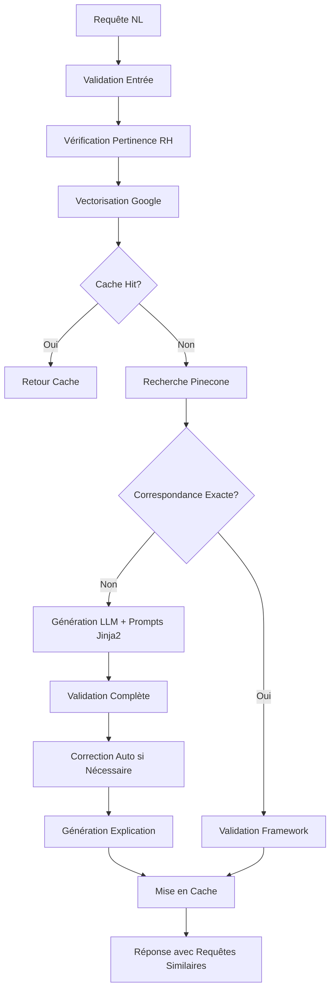

# 🚀 NL2SQL API

<div align="center">


[](https://fastapi.tiangolo.com/)
[](https://openai.com/)
[](https://www.pinecone.io/)
[](https://www.python.org/)
[](https://www.docker.com/)
[](https://opensource.org/licenses/MIT)

_API intelligente qui traduit vos questions en langage naturel en requêtes SQL optimisées avec recherche vectorielle sémantique, support multi-LLM et prompts Jinja2 modulaires_

[🚀 Installation](#-installation) • [💻 Utilisation](#-utilisation) • [🛡️ Sécurité](#%EF%B8%8F-architecture-de-sécurité) • [⚙️ Configuration](#%EF%B8%8F-configuration) • [❓ FAQ](#-faq)

</div>

---

## ✨ Fonctionnalités Clés

- 🧠 **Multi-LLM** - Support OpenAI (GPT-4o), Anthropic (Claude), Google (Gemini)
- 🔍 **Recherche Sémantique** - Utilise Pinecone pour trouver des requêtes similaires
- 🛡️ **Sécurité Renforcée** - Framework obligatoire avec filtres utilisateur automatiques
- ⚡ **Cache Intelligent** - Redis avec contrôle granulaire par requête
- 📋 **Validation Avancée** - Service unifié : syntaxe, sécurité, framework et sémantique
- 📚 **Documentation Interactive** - Swagger UI et ReDoc intégrés
- 🐳 **Conteneurisé** - Déploiement avec Docker et Docker Compose
- 🔧 **Configurable** - Variables d'environnement pour tous les paramètres
- 📊 **Monitoring** - Métriques de performance et logs détaillés
- 🎯 **Prompts Jinja2** - Templates modulaires et personnalisables avec contexte dynamique

## 🏗️ Architecture



## 🚀 Installation

### Prérequis

- Python 3.8+
- Clés API pour au moins un LLM provider
- Clé API Pinecone
- Redis (optionnel, pour le cache)
- Docker & Docker Compose (optionnel)

### 🔧 Installation Standard

1. **Cloner le repository**
   ```bash
   git clone https://github.com/datasulting/nl2sql-api.git
   cd nl2sql-api
   ```

2. **Créer l'environnement virtuel**
   ```bash
   python -m venv venv
   source venv/bin/activate  # Linux/macOS
   venv\Scripts\activate     # Windows
   ```

3. **Installer les dépendances**
   ```bash
   pip install -r requirements.txt
   ```

4. **Configuration**
   ```bash
   cp .env.example .env
   ```
   
   Éditez `.env` avec vos clés API :
   ```env
   # Obligatoire
   PINECONE_API_KEY=your_key_here
   OPENAI_API_KEY=your_key_here
   
   # Optionnel pour multi-LLM
   ANTHROPIC_API_KEY=your_key_here
   GOOGLE_API_KEY=your_key_here
   
   # Configuration base
   PINECONE_INDEX_NAME=kpi-to-sql-gemini
   DEFAULT_PROVIDER=openai
   EMBEDDING_MODEL=text-embedding-004
   EMBEDDING_PROVIDER=google
   ```

5. **Ajouter votre schéma**
   ```bash
   mkdir -p app/schemas
   # Copier votre fichier de schéma SQL/Markdown
   cp your-schema.md app/schemas/
   ```

6. **Lancer l'application**
   ```bash
   python -m app.main
   ```

### 🐳 Installation avec Docker

1. **Préparer la configuration**
   ```bash
   git clone https://github.com/datasulting/nl2sql-api.git
   cd nl2sql-api
   cp .env.example .env
   # Éditer .env avec vos clés
   ```

2. **Lancer avec Docker Compose**
   ```bash
   docker-compose up -d
   ```

L'API sera accessible sur http://localhost:8000

## 💻 Utilisation

### 📖 Documentation Interactive

- **Swagger UI** : http://localhost:8000/docs
- **ReDoc** : http://localhost:8000/redoc

### 🔄 Endpoint Principal : `/api/v1/translate`

```bash
curl -X POST "http://localhost:8000/api/v1/translate" \
  -H "Content-Type: application/json" \
  -H "X-API-Key: your_api_key" \
  -d '{
    "query": "Quel est l'âge moyen de mes collaborateurs ?",
    "provider": "openai",
    "model": "gpt-4o",
    "explain": true,
    "use_cache": true,
    "include_similar_details": true
  }'
```

### 📋 Paramètres Disponibles

| Paramètre | Type | Défaut | Description |
|-----------|------|--------|-------------|
| `query` | string | **requis** | Question en langage naturel |
| `provider` | string | `openai` | LLM à utiliser (`openai`, `anthropic`, `google`) |
| `model` | string | auto | Modèle spécifique (ex: `gpt-4o`, `claude-3-opus-20240229`) |
| `validate` | boolean | `true` | Valider la requête SQL générée |
| `explain` | boolean | `true` | Fournir une explication |
| `use_cache` | boolean | `true` | Utiliser le cache Redis |
| `include_similar_details` | boolean | `false` | Inclure les détails des vecteurs similaires |
| `schema_path` | string | auto | Chemin du schéma (optionnel) |
| `user_id_placeholder` | string | `"?"` | Placeholder pour l'ID utilisateur |

### 🎯 Exemples d'Utilisation

<details>
<summary><b>Exemple avec Python</b></summary>

```python
import requests

url = "http://localhost:8000/api/v1/translate"
headers = {
    "Content-Type": "application/json",
    "X-API-Key": "your_api_key"
}

# Requête simple
response = requests.post(url, headers=headers, json={
    "query": "Combien d'employés en CDI ?",
    "provider": "openai"
})

result = response.json()
print(f"SQL: {result['sql']}")
print(f"Explication: {result['explanation']}")

# Requête avancée avec détails des vecteurs similaires
response = requests.post(url, headers=headers, json={
    "query": "Top 10 des salaires les plus élevés en 2023",
    "provider": "anthropic",
    "model": "claude-3-opus-20240229",
    "use_cache": False,
    "include_similar_details": True
})
```

</details>

<details>
<summary><b>Réponse Type avec Requêtes Similaires</b></summary>

```json
{
  "query": "Quel est l'âge moyen de mes collaborateurs ?",
  "sql": "SELECT ROUND(AVG(TRUNCATE(b.AGE, 0)), 2) AS Age_Moyen FROM depot a INNER JOIN facts b ON a.ID = b.ID_NUMDEPOT WHERE a.ID_USER = ? AND (b.FIN_CONTRAT = 'null' OR b.FIN_CONTRAT > a.datefin); #DEPOT_a# #FACTS_b# #PERIODE#",
  "valid": true,
  "validation_message": "Validation complète réussie",
  "explanation": "Cette requête calcule l'âge moyen des collaborateurs encore en contrat.",
  "is_exact_match": false,
  "status": "success",
  "processing_time": 8.979,
  "similar_queries_details": [
    {
      "score": 0.724,
      "texte_complet": "Age moyen par établissement",
      "requete": "SELECT ROUND(AVG(b.AGE), 2) FROM depot a INNER JOIN facts b...",
      "id": "gemini_load_1748246903_1381"
    }
  ],
  "framework_compliant": true,
  "from_cache": false,
  "provider": "openai",
  "model": "gpt-4o"
}
```

</details>

### 🛡️ Autres Endpoints

| Endpoint | Méthode | Description |
|----------|---------|-------------|
| `/api/v1/health` | GET | État de santé des services |
| `/api/v1/models` | GET | Modèles LLM disponibles |
| `/api/v1/schemas` | GET | Schémas SQL disponibles |
| `/api/v1/validate-framework` | POST | Validation framework d'une requête |
| `/api/v1/prompts/templates` | GET | Templates de prompts Jinja2 |
| `/api/v1/cache/stats` | GET | Statistiques du cache Redis |

## 🛡️ Architecture de Sécurité

### Framework Obligatoire

Chaque requête SQL générée **DOIT OBLIGATOIREMENT** respecter :

1. **Filtre Utilisateur** : `WHERE [alias_depot].ID_USER = ?`
2. **Table DEPOT** : Toujours présente pour les autorisations multi-tenant
3. **Hashtags** : `#DEPOT_[alias]#` minimum + contextuels (#PERIODE#, #FACTS_[alias]#)
4. **Lecture Seule** : Uniquement SELECT (pas d'INSERT/UPDATE/DELETE)

### Exemple de Requête Conforme

```sql
SELECT b.NOM, b.PRENOM, ROUND(AVG(b.AGE), 2) AS AGE_MOYEN
FROM depot a 
INNER JOIN facts b ON a.ID = b.ID_NUMDEPOT  
WHERE a.ID_USER = ? 
  AND (b.FIN_CONTRAT = 'null' OR b.FIN_CONTRAT > a.datefin)
  AND CONCAT(SUBSTRING(a.periode, 5, 4), SUBSTRING(a.periode, 3, 2)) IN (
    SELECT MAX(CONCAT(SUBSTRING(w.periode, 5, 4), SUBSTRING(w.periode, 3, 2)))
    FROM depot w
    WHERE w.periode IN (#PERIODE#)
    AND w.id_user = a.id_user
  )
GROUP BY b.NOM, b.PRENOM
ORDER BY AGE_MOYEN DESC;
#DEPOT_a# #FACTS_b# #PERIODE#
```

### Validation Multi-Niveaux

Le `ValidationService` effectue une validation complète :

1. ✅ **Validation Syntaxique** - Structure SQL correcte
2. ✅ **Validation Sécurité** - Pas d'opérations destructives
3. ✅ **Validation Framework** - Respect des règles obligatoires
4. ✅ **Validation Sémantique** - Correspondance avec la demande (LLM)
5. ✅ **Correction Automatique** - Auto-fix si framework non conforme

## ⚙️ Configuration

### Variables d'Environnement

#### 🔑 API Keys (Obligatoires)

```env
PINECONE_API_KEY=your_pinecone_key
OPENAI_API_KEY=your_openai_key
ANTHROPIC_API_KEY=your_anthropic_key  # Optionnel
GOOGLE_API_KEY=your_google_key        # Optionnel
```

#### 🤖 Configuration LLM

```env
DEFAULT_PROVIDER=openai               # openai, anthropic, google
DEFAULT_OPENAI_MODEL=gpt-4o
DEFAULT_ANTHROPIC_MODEL=claude-3-opus-20240229
DEFAULT_GOOGLE_MODEL=gemini-pro
LLM_TEMPERATURE=0.2
LLM_TIMEOUT=30
```

#### 🔍 Configuration Embedding et Recherche

```env
# Embedding Google (nouveau)
EMBEDDING_MODEL=text-embedding-004    # Google text-embedding-004
EMBEDDING_PROVIDER=google             # google (par défaut)
EMBEDDING_DIMENSIONS=768              # 768 pour text-embedding-004

# Recherche vectorielle
EXACT_MATCH_THRESHOLD=0.95            # Seuil correspondance exacte
TOP_K_RESULTS=5                       # Nombre résultats similaires
SCHEMA_PATH=app/schemas/datasulting.md
```

#### 🗄️ Configuration Pinecone

```env
PINECONE_INDEX_NAME=kpi-to-sql-gemini # Nom de votre index
PINECONE_ENVIRONMENT=gcp-starter      # Environnement Pinecone
```

#### 🗄️ Configuration Cache Redis

```env
REDIS_URL=redis://localhost:6379/0
REDIS_TTL=3600                # Durée cache (secondes)
CACHE_ENABLED=true
```

#### 🔐 Configuration Sécurité

```env
API_KEY=your_secret_api_key   # Authentification (optionnel)
API_KEY_NAME=X-API-Key
ALLOWED_HOSTS=["*","localhost","127.0.0.1"]
DEBUG=false
```

## 🔧 Architecture du Projet - Service Layer Pattern

```
nl2sql-api/
├── app/                      # Code source principal
│   ├── api/                  # Couche API (FastAPI)
│   │   ├── models.py         # Modèles Pydantic avec SimilarQueryDetail
│   │   └── routes.py         # Endpoints avec gestion d'erreurs centralisée
│   ├── services/             # 🆕 COUCHE SERVICE LAYER
│   │   ├── translation_service.py  # Service principal NL2SQL
│   │   └── validation_service.py   # Service unifié de validation
│   ├── core/                 # Couche métier
│   │   ├── llm_factory.py    # Factory Pattern pour Multi-LLM
│   │   ├── llm_providers.py  # Providers OpenAI/Anthropic/Google
│   │   ├── llm_service.py    # Service LLM unifié
│   │   ├── embedding.py      # Google text-embedding-004
│   │   ├── vector_search.py  # Pinecone avec gestion ScoredVector
│   │   ├── http_client.py    # Client HTTP avec retry automatique
│   │   └── exceptions.py     # Exceptions centralisées
│   ├── prompts/              # 🆕 SYSTÈME DE PROMPTS JINJA2
│   │   ├── prompt_manager.py # Gestionnaire central des prompts
│   │   ├── sql_generation.j2 # Templates de génération SQL
│   │   └── sql_validation.j2 # Templates de validation
│   ├── utils/                # Utilitaires
│   │   ├── cache.py          # Redis avec exceptions
│   │   ├── cache_decorator.py # Décorateur @cache_service_method
│   │   ├── schema_loader.py  # Chargement schémas
│   │   └── validators.py     # Validations (deprecated → ValidationService)
│   ├── schemas/              # Schémas SQL/MD
│   │   └── datasulting.md    # Schéma RH avec exemples
│   ├── config.py             # Configuration Pydantic
│   ├── dependencies.py       # Dépendances FastAPI
│   ├── security.py          # Middlewares sécurité
│   └── main.py              # Point d'entrée avec Service Layer
├── docker/                  # Configuration Docker
├── tests/                   # Tests unitaires
├── .env.example            # Template configuration
├── requirements.txt        # Dépendances Python
└── README.md
```

## 🔄 Flux de Traduction Complet - Service Layer

1. **Réception API** : Validation requête utilisateur (`routes.py`)
2. **Service de Traduction** : `TranslationService.translate()` orchestrateur principal
3. **Validation d'Entrée** : `ValidationService.validate_user_input()`
4. **Pertinence RH** : Vérification via LLM Factory
5. **Cache Check** : Décorateur `@cache_service_method`
6. **Embedding** : Google `text-embedding-004` (768 dimensions)
7. **Recherche Vectorielle** : Pinecone avec gestion `ScoredVector`
8. **Correspondance Exacte** : Seuil configurable (0.95)
9. **Génération LLM** : Via prompts Jinja2 avec contexte dynamique
10. **Validation Complète** : `ValidationService.validate_complete()`
11. **Correction Auto** : Framework compliance si nécessaire
12. **Explication** : Génération via LLM avec prompts spécialisés
13. **Cache Storage** : Stockage résultat si succès
14. **Réponse Enrichie** : Avec `similar_queries_details` et métadonnées

## 🧪 Tests

```bash
# Installation des dépendances de test
pip install pytest pytest-asyncio httpx

# Lancer les tests
pytest tests/ -v

# Tests avec couverture
pytest tests/ --cov=app --cov-report=html
```

## 📊 Monitoring & Métriques

### Endpoints de Monitoring

- **Health Check** : `/api/v1/health` - État de tous les services
- **Service Debug** : `/api/v1/debug/service-status` (mode debug uniquement)
- **Prompts Status** : `/api/v1/prompts/health` - État système Jinja2

### Logs Structurés - Service Layer

```python
# Exemple de log
2025-05-30 09:20:26 - app.services.translation_service - INFO - Traduction terminée en 9.524s (statut: success, framework: conforme, vecteurs similaires: 5)
```

### Métriques Disponibles

- Temps de traitement par requête
- Taux de cache hit/miss Redis
- Distribution par provider LLM
- Taux de conformité framework
- Qualité des vecteurs similaires (scores)

## 🚀 Déploiement Production

### Docker Compose (Recommandé)

```yaml
version: '3.8'
services:
  api:
    image: nl2sql-api:latest
    environment:
      - PINECONE_API_KEY=${PINECONE_API_KEY}
      - OPENAI_API_KEY=${OPENAI_API_KEY}
      - GOOGLE_API_KEY=${GOOGLE_API_KEY}
      - REDIS_URL=redis://redis:6379/0
      - EMBEDDING_MODEL=text-embedding-004
      - EMBEDDING_PROVIDER=google
    depends_on:
      - redis
  
  redis:
    image: redis:alpine
    command: redis-server --appendonly yes
    volumes:
      - redis-data:/data

  nginx:
    image: nginx:alpine
    ports:
      - "80:80"
    volumes:
      - ./nginx.conf:/etc/nginx/nginx.conf

volumes:
  redis-data:
```

### Variables pour Production

```env
DEBUG=false
CACHE_ENABLED=true
METRICS_ENABLED=true
API_KEY=generate_strong_secret
ALLOWED_HOSTS=["your-domain.com","api.your-domain.com"]
EMBEDDING_MODEL=text-embedding-004
EMBEDDING_PROVIDER=google
```

## ❓ FAQ

<details>
<summary><b>Comment l'API évite-t-elle la pollution de ma base vectorielle ?</b></summary>

L'API ne stocke **JAMAIS** automatiquement de nouvelles requêtes dans Pinecone. Elle utilise uniquement la base existante pour la recherche sémantique. Le stockage peut être activé manuellement si nécessaire via le paramètre `store_result=True`.

</details>

<details>
<summary><b>Quels sont les providers LLM supportés et leurs modèles ?</b></summary>

- **OpenAI** : GPT-4o, GPT-4o Mini, GPT-4 Turbo, GPT-4, GPT-3.5 Turbo
- **Anthropic** : Claude 3 Opus, Claude 3 Sonnet, Claude 3 Haiku, Claude 3.5 Sonnet
- **Google** : Gemini Pro, Gemini 1.5 Pro, Gemini 1.5 Flash

</details>

<details>
<summary><b>Comment fonctionne le nouveau système d'embedding Google ?</b></summary>

L'API utilise maintenant **Google text-embedding-004** (768 dimensions) au lieu de Sentence Transformers. Cela offre :
- Meilleure qualité de vectorisation
- Pas de modèle local à télécharger
- Compatibilité avec l'écosystème Google AI

</details>

<details>
<summary><b>Que sont les "similar_queries_details" dans la réponse ?</b></summary>

C'est une nouvelle fonctionnalité qui retourne les détails complets des 5 vecteurs les plus similaires trouvés dans Pinecone :
```json
"similar_queries_details": [
  {
    "score": 0.724,
    "texte_complet": "Age moyen par établissement", 
    "requete": "SELECT ROUND(AVG(b.AGE), 2)...",
    "id": "gemini_load_1748246903_1381"
  }
]
```

</details>

<details>
<summary><b>Comment fonctionne le système de prompts Jinja2 ?</b></summary>

Les prompts sont maintenant modulaires et personnalisables :
1. **Templates** : `sql_generation.j2`, `sql_validation.j2`
2. **Contexte dynamique** : période, département, mode strict
3. **Macros réutilisables** : `system_message()`, `generate_sql_prompt()`
4. **Fallback automatique** : si Jinja2 échoue, utilise prompts par défaut

</details>

<details>
<summary><b>Le cache Redis est-il obligatoire ?</b></summary>

Non, Redis est optionnel. Sans Redis :
- Les performances seront légèrement impactées
- Chaque requête sera retraitée complètement
- La limitation de débit utilisera une mémoire interne
- Les logs indiqueront "Redis non disponible, le cache sera désactivé"
</details>

<details>
<summary><b>Comment personnaliser le schéma de base de données ?</b></summary>

1. Créez votre fichier `.sql` ou `.md` dans `app/schemas/`
2. Modifiez `SCHEMA_PATH` dans votre `.env`
3. Redémarrez l'application

Le schéma peut être en SQL standard ou en Markdown documenté avec exemples.

</details>

## 🆕 Nouveautés v2.0.0

### **Architecture Service Layer**
- ✅ `TranslationService` : Orchestrateur principal
- ✅ `ValidationService` : Validation unifiée 
- ✅ Factory Pattern pour Multi-LLM
- ✅ Exceptions centralisées

### **Système de Prompts Jinja2**
- ✅ Templates modulaires (`sql_generation.j2`, `sql_validation.j2`)
- ✅ Contexte dynamique (période, département, mode strict)
- ✅ Fallback automatique vers prompts par défaut

### **Embedding Google**
- ✅ `text-embedding-004` (768 dimensions)
- ✅ Plus de dépendance Sentence Transformers
- ✅ Meilleure qualité de vectorisation

### **Recherche Vectorielle Améliorée**
- ✅ Support objets `ScoredVector` de Pinecone
- ✅ `similar_queries_details` avec score, texte complet, requête SQL et ID
- ✅ Normalisation automatique des métadonnées

### **Cache et Performance**
- ✅ Décorateur `@cache_service_method` pour services
- ✅ Contrôle granulaire par requête (`use_cache`)
- ✅ Métriques de performance détaillées

## 🤝 Contribution

Les contributions sont bienvenues ! Voir [CONTRIBUTING.md](CONTRIBUTING.md) pour les guidelines.

## 📄 Licence

Ce projet est sous licence MIT. Voir [LICENSE](LICENSE) pour plus de détails.

## 📞 Support

- **Organisation** : [Datasulting](https://datasulting.com)
- **Email** : support@datasulting.com
- **Documentation** : [Wiki du projet](../../wiki)

---

<div align="center">
<p>✨ <strong>NL2SQL API v2.0.0 - Architecture Service Layer avec Prompts Jinja2</strong> ✨</p>
<p>Développé avec ❤️ par <a href="https://datasulting.com">Datasulting</a></p>
<p><em>Version 2.0.0 - Service Layer + Multi-LLM + Prompts Modulaires + Google Embedding</em></p>
</div>