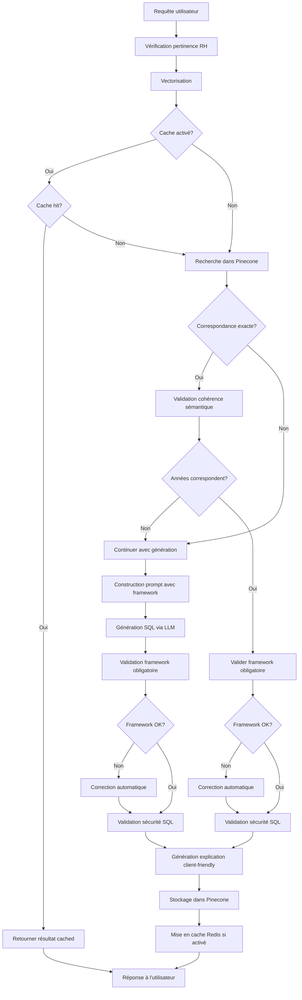

# 📊 NL2SQL API

<div align="center">


[](https://fastapi.tiangolo.com/)
[](https://openai.com/)
[](https://www.pinecone.io/)
[](https://www.python.org/)
[](https://www.docker.com/)
[](https://opensource.org/licenses/MIT)

_Une API intelligente qui traduit vos questions en langage naturel en requêtes SQL optimisées avec framework de sécurité obligatoire_

[Installation](#installation) • [Utilisation](#utilisation) • [Framework Obligatoire](#framework-obligatoire) • [Configuration](#configuration) • [FAQ](#faq) • [Contact](#contact)

</div>

---

## 🌟 Fonctionnalités

- 🔄 **Traduction Intuitive** - Transformez des questions en langage naturel en SQL performant
- 🛡️ **Framework de Sécurité Obligatoire** - Chaque requête inclut automatiquement les filtres utilisateur nécessaires
- 🧠 **Apprentissage Continu** - Le système s'améliore au fur et à mesure de son utilisation
- 🔍 **Recherche Vectorielle** - Utilisation de Pinecone pour trouver des requêtes similaires
- 🤖 **Intelligence Artificielle Multi-Provider** - Support OpenAI, Anthropic, Google
- 🔐 **Sécurisé** - Authentication par clé API, validation des entrées, limitation de débit
- 📝 **Documentation Interactive** - Interface Swagger UI complète et intuitive
- 🐳 **Conteneurisé** - Déploiement facile avec Docker et Docker Compose
- 🔄 **Mise en Cache Redis Contrôlable** - Stockage temporaire avec contrôle par requête
- 🔍 **Validation SQL Avancée** - Vérification rigoureuse de la syntaxe et compatibilité
- 🛡️ **Mode Lecture Seule** - Protection contre les opérations d'écriture dangereuses
- 📊 **Métriques de Performance** - Suivi des temps de traitement et du cache

## 🚀 Installation

### Prérequis

- Python 3.8+
- Clé API [Pinecone](https://www.pinecone.io/)
- Clé API [OpenAI](https://openai.com/)
- Redis (optionnel, pour la mise en cache)
- Docker & Docker Compose (optionnel, pour déploiement conteneurisé)

### Installation Standard

1. **Cloner le dépôt**

   ```bash
   git clone https://github.com/datasulting/nl2sql-api.git
   cd nl2sql-api
   ```

2. **Créer un environnement virtuel**

   ```bash
   python -m venv venv
   source venv/bin/activate  # Linux/macOS
   venv\Scripts\activate     # Windows
   ```

3. **Installer les dépendances**

   ```bash
   pip install -r requirements.txt
   ```

4. **Configurer l'environnement**

   ```bash
   cp .env.example .env
   ```

   Modifiez le fichier `.env` avec vos clés API et paramètres.

5. **Ajouter un schéma SQL**

   Créez un fichier de schéma SQL dans le répertoire `app/schemas/`:
   
   ```bash
   mkdir -p app/schemas
   touch app/schemas/datasulting.sql
   ```
   
   Ajoutez votre schéma de base de données dans ce fichier.

### Installation avec Docker

1. **Cloner le dépôt**

   ```bash
   git clone https://github.com/datasulting/nl2sql-api.git
   cd nl2sql-api
   ```

2. **Configurer l'environnement**

   ```bash
   cp .env.example .env
   ```

   Modifiez le fichier `.env` avec vos clés API et paramètres.

3. **Ajouter un schéma SQL** 

   Créez votre schéma SQL dans `app/schemas/datasulting.sql`.

4. **Lancer avec Docker Compose**

   ```bash
   cd docker
   docker-compose up -d
   ```

## 💻 Utilisation

### Démarrer l'application

```bash
python -m app.main
```

L'API sera accessible à l'adresse http://localhost:8000

### Documentation Interactive

- **Swagger UI**: http://localhost:8000/docs
- **ReDoc**: http://localhost:8000/redoc

## 🛡️ Framework Obligatoire pour les Requêtes SQL

Cette API applique un framework obligatoire à toutes les requêtes SQL générées pour garantir la sécurité et la cohérence :

### Éléments Obligatoires

1. **Filtre Utilisateur** : Chaque requête DOIT contenir `WHERE [alias_depot].ID_USER = ?`
2. **Table DEPOT** : La table DEPOT doit toujours être présente (directement ou via JOIN)
3. **Hashtags** : Ajout automatique de hashtags en fin de requête selon le contexte :
   - `#DEPOT_[alias]#` pour la table DEPOT
   - `#FACTS_[alias]#` si utilisation de la table FACTS  
   - `#PERIODE#` pour les requêtes temporelles

### Exemple de Requête Conforme

```sql
SELECT f.NOM, f.PRENOM, f.MNT_BRUT
FROM FACTS f
JOIN DEPOT d ON f.ID_NUMDEPOT = d.ID  
WHERE d.ID_USER = ? 
  AND f.NATURE_CONTRAT = '01'
ORDER BY f.NOM; #DEPOT_d# #FACTS_f#
```

### Validation Automatique

L'API valide automatiquement que chaque requête générée respecte ce framework :
- Si la requête n'est pas conforme, l'API tente de la corriger automatiquement
- En cas d'échec de correction, une erreur est retournée avec le message explicatif

## 📝 Exemples d'utilisation

### Requête Complète avec Tous les Paramètres

<details>
<summary><b>Exemple avec curl</b></summary>

```bash
curl -X 'POST' \
  'http://localhost:8000/api/v1/translate' \
  -H 'accept: application/json' \
  -H 'Content-Type: application/json' \
  -H 'X-API-Key: votre_clé_api' \
  -d '{
  "query": "Liste des employés en CDI embauchés en 2020",
  "schema_path": null,
  "validate": true,
  "explain": true,
  "provider": "openai",
  "model": "gpt-4o",
  "user_id_placeholder": "?",
  "use_cache": false
}'
```

</details>

<details>
<summary><b>Exemple avec Python</b></summary>

```python
import requests
import json

url = "http://localhost:8000/api/v1/translate"
headers = {
    "accept": "application/json",
    "Content-Type": "application/json",
    "X-API-Key": "votre_clé_api"
}
payload = {
    "query": "Liste des employés en CDI embauchés en 2020",
    "schema_path": None,
    "validate": True,
    "explain": True,
    "provider": "openai",
    "model": "gpt-4o",
    "user_id_placeholder": "?",
    "use_cache": False
}

response = requests.post(url, headers=headers, json=payload)
print(json.dumps(response.json(), indent=2))
```

</details>

<details>
<summary><b>Réponse Typique</b></summary>

```json
{
  "query": "Liste des employés en CDI embauchés en 2020",
  "sql": "SELECT f.ID, f.MATRICULE, f.NOM, f.PRENOM\nFROM FACTS f\nJOIN DEPOT d ON f.ID_NUMDEPOT = d.ID\nWHERE d.ID_USER = ? \n  AND f.NATURE_CONTRAT = '01'\n  AND YEAR(f.DEBUT_CONTRAT) = 2020; #DEPOT_d# #FACTS_f#",
  "valid": true,
  "validation_message": "La requête SQL est sécurisée. La requête respecte le framework obligatoire.",
  "explanation": "Cette requête affiche la liste des employés en CDI embauchés en 2020.",
  "is_exact_match": false,
  "status": "success",
  "processing_time": 2.34,
  "similar_queries": null,
  "framework_compliant": true,
  "from_cache": false
}
```

</details>

### Contrôle du Cache

#### Avec Cache (Par Défaut)
```json
{
  "query": "Liste des CDI embauchés en 2022",
  "use_cache": true
}
```

#### Sans Cache (Pour Tests)
```json
{
  "query": "Liste des CDI embauchés en 2022",  
  "use_cache": false
}
```

### Autres Endpoints

#### Vérifier l'état de santé de l'API

```bash
curl -X 'GET' \
  'http://localhost:8000/api/v1/health' \
  -H 'accept: application/json' \
  -H 'X-API-Key: votre_clé_api'
```

#### Obtenir la liste des schémas disponibles

```bash
curl -X 'GET' \
  'http://localhost:8000/api/v1/schemas' \
  -H 'accept: application/json' \
  -H 'X-API-Key: votre_clé_api'
```

#### Valider le framework d'une requête SQL

```bash
curl -X 'POST' \
  'http://localhost:8000/api/v1/validate-framework' \
  -H 'accept: application/json' \
  -H 'Content-Type: application/json' \
  -H 'X-API-Key: votre_clé_api' \
  -d '{
  "sql_query": "SELECT * FROM FACTS;",
  "user_id_placeholder": "?"
}'
```

## 🏗️ Architecture

L'application est structurée de manière modulaire, avec une séparation claire des responsabilités :

```
nl2sql-api/
├── app/                      # Code source principal
│   ├── api/                  # Endpoints de l'API
│   │   ├── models.py         # Modèles de données Pydantic
│   │   └── routes.py         # Routes FastAPI
│   ├── core/                 # Logique métier principale
│   │   ├── translator.py     # Traducteur NL vers SQL avec framework
│   │   ├── embedding.py      # Vectorisation avec SentenceTransformer
│   │   ├── vector_search.py  # Recherche vectorielle avec Pinecone
│   │   └── llm.py            # Interaction avec l'API OpenAI/Anthropic
│   ├── utils/                # Utilitaires
│   │   ├── schema_loader.py  # Chargement des schémas SQL
│   │   ├── validators.py     # Validation des entrées/sorties
│   │   ├── sql_validator.py  # Validation avancée des requêtes SQL
│   │   ├── cache.py          # Gestion du cache Redis contrôlable
│   │   └── simple_framework_check.py # Validation du framework obligatoire
│   ├── schemas/              # Schémas SQL des bases de données
│   ├── security.py           # Configuration de sécurité
│   ├── dependencies.py       # Dépendances FastAPI
│   ├── config.py             # Configuration multi-provider
│   └── main.py               # Point d'entrée de l'application
├── docker/                   # Configuration Docker
├── tests/                    # Tests unitaires et d'intégration
├── .env.example              # Exemple de variables d'environnement
├── requirements.txt          # Dépendances Python
└── README.md                 # Documentation
```

### Flux de traitement avec Framework Obligatoire



## ⚙️ Configuration

L'application est configurable via le fichier `.env` ou des variables d'environnement :

### Variables Obligatoires

| Variable | Description | Exemple |
|----------|-------------|---------|
| `PINECONE_API_KEY` | Clé API Pinecone | `pcsk_...` |
| `OPENAI_API_KEY` | Clé API OpenAI | `sk-proj-...` |

### Variables LLM et Providers

| Variable | Description | Valeur par défaut |
|----------|-------------|-------------------|
| `DEFAULT_PROVIDER` | Provider LLM par défaut | `openai` |
| `DEFAULT_OPENAI_MODEL` | Modèle OpenAI par défaut | `gpt-4o` |
| `DEFAULT_ANTHROPIC_MODEL` | Modèle Anthropic par défaut | `claude-3-opus-20240229` |
| `DEFAULT_GOOGLE_MODEL` | Modèle Google par défaut | `gemini-pro` |
| `LLM_TEMPERATURE` | Température pour la génération | `0.2` |
| `LLM_TIMEOUT` | Délai d'attente LLM (secondes) | `30` |

### Variables Framework et Sécurité

| Variable | Description | Valeur par défaut |
|----------|-------------|-------------------|
| `EXACT_MATCH_THRESHOLD` | Seuil pour correspondance exacte | `0.95` |
| `TOP_K_RESULTS` | Nombre de résultats similaires | `5` |
| `SCHEMA_PATH` | Chemin vers le fichier de schéma SQL | `app/schemas/datasulting.sql` |
| `SQL_READ_ONLY` | Restreint aux requêtes SELECT uniquement | `true` |

### Variables Cache Redis

| Variable | Description | Valeur par défaut |
|----------|-------------|-------------------|
| `REDIS_URL` | URL du serveur Redis | (Facultatif) |
| `REDIS_TTL` | Durée de vie du cache en secondes | `3600` |
| `CACHE_ENABLED` | Activation du cache Redis | `true` |

### Variables API et Sécurité

| Variable | Description | Valeur par défaut |
|----------|-------------|-------------------|
| `API_PREFIX` | Préfixe pour les routes API | `/api/v1` |
| `API_KEY` | Clé API pour l'authentification | (Facultatif) |
| `API_KEY_NAME` | Nom de l'en-tête pour la clé API | `X-API-Key` |
| `ALLOWED_HOSTS` | Liste des hôtes autorisés | `["*"]` |
| `DEBUG` | Mode débogage | `false` |

## 📊 Intégration avec n8n

Pour intégrer cette API avec [n8n](https://n8n.io/) :

1. Ajoutez un nœud **HTTP Request** dans votre workflow n8n
2. Configurez le nœud comme suit :
   - Méthode : `POST`
   - URL : `http://votre-serveur:8000/api/v1/translate`
   - En-têtes : `X-API-Key: votre_clé_api`
   - Corps de la requête (JSON) :
     ```json
     {
       "query": "{{$input.item.json.query}}",
       "validate": true,
       "explain": true,
       "use_cache": true
     }
     ```

3. Utilisez la réponse dans les nœuds suivants de votre workflow :
   - `{{$node["HTTP Request"].json.sql}}` pour la requête SQL générée
   - `{{$node["HTTP Request"].json.explanation}}` pour l'explication
   - `{{$node["HTTP Request"].json.framework_compliant}}` pour vérifier la conformité

## ❓ FAQ

<details>
<summary><b>Comment fonctionne le framework obligatoire ?</b></summary>

Le framework obligatoire garantit que chaque requête SQL :
1. Inclut un filtre `WHERE depot.ID_USER = ?` pour la sécurité
2. Utilise la table DEPOT pour l'autorisation
3. Contient les hashtags appropriés pour la gestion des permissions

Si une requête générée n'est pas conforme, l'API tente de la corriger automatiquement.

</details>

<details>
<summary><b>Comment contrôler l'utilisation du cache ?</b></summary>

Utilisez le paramètre `use_cache` dans votre requête :
- `"use_cache": true` (défaut) : Utilise le cache Redis si disponible
- `"use_cache": false` : Force la régénération, utile pour les tests

Le champ `from_cache` dans la réponse indique si le résultat vient du cache.

</details>

<details>
<summary><b>Comment améliorer la qualité des traductions SQL ?</b></summary>

1. **Schéma SQL détaillé** - Plus votre schéma est complet, meilleures sont les traductions
2. **Utilisation régulière** - Le système apprend des requêtes précédentes
3. **Questions précises** - Formulez vos questions de manière claire et précise
4. **Seuil de correspondance** - Ajustez `EXACT_MATCH_THRESHOLD` pour éviter les faux positifs

</details>

<details>
<summary><b>L'API peut-elle traduire des requêtes dans d'autres langues ?</b></summary>

Oui, l'API utilise des modèles d'embedding et LLM multilingues. Elle peut traiter des requêtes dans différentes langues, bien que les performances soient optimisées pour le français dans le contexte RH.

</details>

<details>
<summary><b>Comment fonctionne la validation sémantique ?</b></summary>

L'API compare automatiquement les éléments temporels (années) entre votre demande et les correspondances trouvées. Si une requête similaire concerne une année différente, elle est rejetée et une nouvelle requête est générée.

</details>

<details>
<summary><b>Que signifient les champs provider et model dans la réponse ?</b></summary>

Ces champs indiquent quel provider LLM (OpenAI, Anthropic, Google) et quel modèle spécifique ont été utilisés pour générer la requête. Utile pour le débogage et l'optimisation.

</details>

## 📞 Contact

- **Entreprise**: Datasulting
- **Site Web**: [datasulting.com](https://datasulting.com)

## 📄 Licence

Ce projet est sous licence MIT. Voir le fichier `LICENSE` pour plus de détails.

---

<div align="center">
<p>Développé avec ❤️ par <a href="https://datasulting.com">Datasulting</a></p>
<p><em>API NL2SQL avec Framework de Sécurité Obligatoire - Version 1.0.0</em></p>
</div>