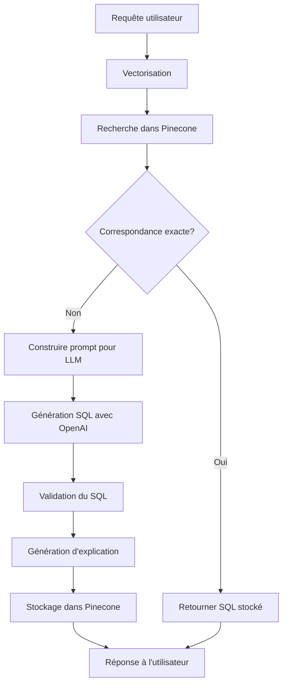

# 📊 NL2SQL API

<div align="center">


[](https://fastapi.tiangolo.com/)
[](https://openai.com/)
[](https://www.pinecone.io/)
[](https://www.python.org/)
[](https://www.docker.com/)
[](https://opensource.org/licenses/MIT)

_Une API intelligente qui traduit vos questions en langage naturel en requêtes SQL optimisées_

[Installation](#installation) • [Utilisation](#utilisation) • [Architecture](#architecture) • [Configuration](#configuration) • [FAQ](#faq) • [Contact](#contact)

</div>

---

## 🌟 Fonctionnalités

- 🔄 **Traduction Intuitive** - Transformez des questions en langage naturel en SQL performant
- 🧠 **Apprentissage Continu** - Le système s'améliore au fur et à mesure de son utilisation
- 🔍 **Recherche Vectorielle** - Utilisation de Pinecone pour trouver des requêtes similaires
- 🤖 **Intelligence Artificielle** - Exploitation des modèles OpenAI pour la génération SQL
- 🔐 **Sécurisé** - Authentication par clé API, validation des entrées, limitation de débit
- 📝 **Documentation Interactive** - Interface Swagger UI complète et intuitive
- 🐳 **Conteneurisé** - Déploiement facile avec Docker et Docker Compose

## 🚀 Installation

### Prérequis

- Python 3.8+
- Clé API [Pinecone](https://www.pinecone.io/)
- Clé API [OpenAI](https://openai.com/)
- Docker & Docker Compose (optionnel, pour déploiement conteneurisé)

### Installation Standard

1. **Cloner le dépôt**

   ```bash
   git clone https://github.com/datasulting/nl2sql-api.git
   cd nl2sql-api
   ```

2. **Créer un environnement virtuel**

   ```bash
   python -m venv venv
   source venv/bin/activate  # Linux/macOS
   venv\Scripts\activate     # Windows
   ```

3. **Installer les dépendances**

   ```bash
   pip install -r requirements.txt
   ```

4. **Configurer l'environnement**

   ```bash
   cp .env.example .env
   ```

   Modifiez le fichier `.env` avec vos clés API et paramètres.

5. **Ajouter un schéma SQL**

   Créez un fichier de schéma SQL dans le répertoire `app/schemas/`:
   
   ```bash
   mkdir -p app/schemas
   touch app/schemas/datasulting.sql
   ```
   
   Ajoutez votre schéma de base de données dans ce fichier.

### Installation avec Docker

1. **Cloner le dépôt**

   ```bash
   git clone https://github.com/datasulting/nl2sql-api.git
   cd nl2sql-api
   ```

2. **Configurer l'environnement**

   ```bash
   cp .env.example .env
   ```

   Modifiez le fichier `.env` avec vos clés API et paramètres.

3. **Ajouter un schéma SQL** 

   Créez votre schéma SQL dans `app/schemas/datasulting.sql`.

4. **Lancer avec Docker Compose**

   ```bash
   cd docker
   docker-compose up -d
   ```

## 💻 Utilisation

### Démarrer l'application

```bash
python -m app.main
```

L'API sera accessible à l'adresse http://localhost:8000

### Documentation Interactive

- **Swagger UI**: http://localhost:8000/docs
- **ReDoc**: http://localhost:8000/redoc

### Exemples d'utilisation

#### Traduire une requête en langage naturel en SQL

<details>
<summary><b>Exemple avec curl</b></summary>

```bash
curl -X 'POST' \
  'http://localhost:8000/api/v1/translate' \
  -H 'accept: application/json' \
  -H 'Content-Type: application/json' \
  -H 'X-API-Key: votre_clé_api' \
  -d '{
  "query": "Liste des clients qui ont effectué plus de 5 commandes en 2023",
  "schema_path": null,
  "validate": true,
  "explain": true
}'
```

</details>

<details>
<summary><b>Exemple avec Python</b></summary>

```python
import requests
import json

url = "http://localhost:8000/api/v1/translate"
headers = {
    "accept": "application/json",
    "Content-Type": "application/json",
    "X-API-Key": "votre_clé_api"
}
payload = {
    "query": "Liste des clients qui ont effectué plus de 5 commandes en 2023",
    "schema_path": None,
    "validate": True,
    "explain": True
}

response = requests.post(url, headers=headers, json=payload)
print(json.dumps(response.json(), indent=2))
```

</details>

<details>
<summary><b>Réponse typique</b></summary>

```json
{
  "query": "Liste des clients qui ont effectué plus de 5 commandes en 2023",
  "sql": "SELECT c.nom, c.prenom, COUNT(cmd.id) as nb_commandes FROM clients c JOIN commandes cmd ON c.id = cmd.client_id WHERE YEAR(cmd.date) = 2023 GROUP BY c.id HAVING COUNT(cmd.id) > 5;",
  "valid": true,
  "validation_message": "La requête SQL correspond bien à votre demande et est compatible avec le schéma.",
  "explanation": "Cette requête recherche les clients ayant passé plus de 5 commandes en 2023, en affichant leur nom et prénom.",
  "is_exact_match": false,
  "status": "success",
  "processing_time": 2.34,
  "similar_queries": null
}
```

</details>

#### Vérifier l'état de santé de l'API

```bash
curl -X 'GET' \
  'http://localhost:8000/api/v1/health' \
  -H 'accept: application/json' \
  -H 'X-API-Key: votre_clé_api'
```

## 🏗️ Architecture

L'application est structurée de manière modulaire, avec une séparation claire des responsabilités :

```
nl2sql-api/
├── app/                      # Code source principal
│   ├── api/                  # Endpoints de l'API
│   │   ├── models.py         # Modèles de données Pydantic
│   │   └── routes.py         # Routes FastAPI
│   ├── core/                 # Logique métier principale
│   │   ├── translator.py     # Traducteur NL vers SQL
│   │   ├── embedding.py      # Vectorisation avec SentenceTransformer
│   │   ├── vector_search.py  # Recherche vectorielle avec Pinecone
│   │   └── llm.py            # Interaction avec l'API OpenAI
│   ├── utils/                # Utilitaires
│   │   ├── schema_loader.py  # Chargement des schémas SQL
│   │   └── validators.py     # Validation des entrées/sorties
│   ├── schemas/              # Schémas SQL des bases de données
│   ├── security.py           # Configuration de sécurité
│   ├── dependencies.py       # Dépendances FastAPI
│   ├── config.py             # Configuration de l'application
│   └── main.py               # Point d'entrée de l'application
├── docker/                   # Configuration Docker
├── tests/                    # Tests unitaires et d'intégration
├── .env.example              # Exemple de variables d'environnement
├── requirements.txt          # Dépendances Python
└── README.md                 # Documentation
```

### Flux de traitement



## ⚙️ Configuration

L'application est configurable via le fichier `.env` ou des variables d'environnement :

| Variable | Description | Valeur par défaut |
|----------|-------------|-------------------|
| `PINECONE_API_KEY` | Clé API Pinecone | (Requis) |
| `OPENAI_API_KEY` | Clé API OpenAI | (Requis) |
| `PINECONE_INDEX_NAME` | Nom de l'index Pinecone | `nl2sql` |
| `PINECONE_ENVIRONMENT` | Environnement Pinecone | `gcp-starter` |
| `EMBEDDING_MODEL` | Modèle d'embedding | `all-mpnet-base-v2` |
| `OPENAI_MODEL` | Modèle OpenAI | `gpt-4o` |
| `OPENAI_TEMPERATURE` | Température pour la génération | `0.2` |
| `EXACT_MATCH_THRESHOLD` | Seuil pour correspondance exacte | `0.95` |
| `TOP_K_RESULTS` | Nombre de résultats similaires | `5` |
| `SCHEMA_PATH` | Chemin vers le fichier de schéma SQL | `app/schemas/datasulting.sql` |
| `API_KEY` | Clé API pour l'authentification | (Facultatif) |
| `API_KEY_NAME` | Nom de l'en-tête pour la clé API | `X-API-Key` |
| `ALLOWED_HOSTS` | Liste des hôtes autorisés | `["*"]` |
| `DEBUG` | Mode débogage | `false` |

## 📊 Intégration avec n8n

Pour intégrer cette API avec [n8n](https://n8n.io/) :

1. Ajoutez un nœud **HTTP Request** dans votre workflow n8n
2. Configurez le nœud comme suit :
   - Méthode : `POST`
   - URL : `http://votre-serveur:8000/api/v1/translate`
   - En-têtes : `X-API-Key: votre_clé_api`
   - Corps de la requête (JSON) :
     ```json
     {
       "query": "{{$input.item.json.query}}",
       "validate": true,
       "explain": true
     }
     ```

3. Utilisez la réponse dans les nœuds suivants de votre workflow :
   - `{{$node["HTTP Request"].json.sql}}` pour la requête SQL générée
   - `{{$node["HTTP Request"].json.explanation}}` pour l'explication

## ❓ FAQ

<details>
<summary><b>Comment puis-je améliorer la qualité des traductions SQL ?</b></summary>

La qualité des traductions dépend de plusieurs facteurs :
1. **Schéma SQL détaillé** - Plus votre schéma est complet, meilleures sont les traductions
2. **Utilisation régulière** - Le système apprend des requêtes précédentes
3. **Questions précises** - Formulez vos questions de manière claire et précise
4. **Modèle LLM** - Utilisez les modèles les plus récents d'OpenAI

</details>

<details>
<summary><b>L'API peut-elle traduire des requêtes dans d'autres langues que le français ?</b></summary>

Oui, l'API utilise des modèles d'embedding et LLM multilingues. Elle peut donc traiter des requêtes dans différentes langues, bien que les performances puissent varier selon la langue.

</details>

<details>
<summary><b>Comment puis-je contribuer au projet ?</b></summary>

Les contributions sont les bienvenues ! Voici comment contribuer :
1. Forkez le dépôt
2. Créez une branche pour votre fonctionnalité
3. Ajoutez vos modifications avec des tests
4. Soumettez une pull request avec une description détaillée

</details>

<details>
<summary><b>Quelles sont les limites de l'API ?</b></summary>

- La complexité des requêtes SQL générées dépend du modèle OpenAI utilisé
- Les performances peuvent varier selon la qualité du schéma SQL fourni
- Les requêtes très spécifiques à un domaine peuvent nécessiter plus d'exemples
- Les limitations de débit d'API sont appliquées pour éviter les abus

</details>

## 📞 Contact

- **Entreprise**: Datasulting
- **Site Web**: [datasulting.com](https://datasulting.com)


## 📄 Licence

Ce projet est sous licence MIT. Voir le fichier `LICENSE` pour plus de détails.

---

<div align="center">
<p>Développé avec ❤️ par <a href="https://datasulting.com">Datasulting</a></p>
</div>