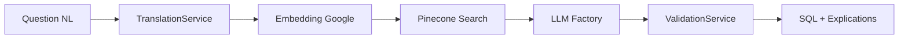

# 🏠 NL2SQL API Wiki - Accueil

Bienvenue dans la documentation complète de **NL2SQL API v2.0.0** ! 🚀

Cette API intelligente traduit vos questions en langage naturel en requêtes SQL optimisées, utilisant une architecture Service Layer moderne avec des prompts Jinja2 modulaires.

## 📚 Navigation du Wiki

### 🚀 **Pour Commencer**
- 🏁 [Guide de Démarrage Rapide](Quick-Start-Guide) - Installation et premier test
- ⚙️ [Configuration Complète](Configuration-Guide) - Variables d'environnement détaillées
- 🐳 [Déploiement Docker](Docker-Deployment) - Conteneurisation et production

### 🏗️ **Architecture & Design**
- 🏛️ [Architecture Service Layer](Service-Layer-Architecture) - Design patterns et responsabilités
- 🧠 [Multi-LLM Factory](Multi-LLM-Factory) - Gestion des fournisseurs IA
- 🔍 [Recherche Vectorielle](Vector-Search-System) - Pinecone et embedding Google
- 🎯 [Système de Prompts Jinja2](Jinja2-Prompts-System) - Templates modulaires

### 🛡️ **Sécurité & Validation**
- 🔒 [Framework de Sécurité](Security-Framework) - Règles obligatoires multi-tenant
- ✅ [Service de Validation](Validation-Service) - Validation unifiée complète
- 🛡️ [Gestion des Erreurs](Error-Handling) - Exceptions centralisées

### 💻 **API & Utilisation**
- 📖 [Référence API](API-Reference) - Tous les endpoints détaillés
- 🔄 [Exemples d'Utilisation](Usage-Examples) - Cas concrets avec code
- 📊 [Format des Réponses](Response-Format) - Structure JSON complète

### 🔧 **Administration & Monitoring**
- 📈 [Monitoring & Métriques](Monitoring-Metrics) - Health checks et performance
- 💾 [Gestion du Cache](Cache-Management) - Redis et optimisations
- 🐛 [Debugging & Logs](Debugging-Logs) - Diagnostic et troubleshooting

### 🗄️ **Base de Données**
- 📋 [Schéma RH Datasulting](Database-Schema) - Structure et conventions
- 🔍 [Requêtes Similaires](Similar-Queries) - Fonctionnement de la recherche sémantique
- 📝 [Guide du Schéma](Schema-Guide) - Comment personnaliser votre schéma

### 🧪 **Développement**
- 🧪 [Tests & Qualité](Testing-Quality) - Tests unitaires et intégration
- 🤝 [Guide de Contribution](Contributing-Guide) - Comment contribuer au projet
- 🔄 [Cycle de Release](Release-Cycle) - Versionning et déploiement

## 🎯 **Vue d'Ensemble Rapide**

### Qu'est-ce que NL2SQL API ?

NL2SQL API transforme des questions comme :
> *"Quel est l'âge moyen de mes collaborateurs en CDI ?"*

En requêtes SQL sécurisées :
```sql
SELECT ROUND(AVG(TRUNCATE(b.AGE, 0)), 2) AS Age_Moyen
FROM depot a 
INNER JOIN facts b ON a.ID = b.ID_NUMDEPOT 
WHERE a.ID_USER = ? 
  AND b.NATURE_CONTRAT = '01'
  AND (b.FIN_CONTRAT = 'null' OR b.FIN_CONTRAT > a.datefin);
#DEPOT_a# #FACTS_b#
```

### Architecture en un Coup d'Œil



### Fonctionnalités Clés ✨

| Fonctionnalité | Description | Status |
|---|---|---|
| 🧠 **Multi-LLM** | OpenAI, Anthropic, Google | ✅ Implémenté |
| 🔍 **Recherche Sémantique** | Pinecone + Google Embedding | ✅ Fonctionnel |
| 🛡️ **Sécurité Multi-Tenant** | Framework obligatoire | ✅ Validé |
| 🎯 **Prompts Jinja2** | Templates modulaires | ✅ Déployé |
| ⚡ **Cache Redis** | Performance optimisée | ✅ Opérationnel |
| 📊 **Monitoring** | Health checks complets | ✅ Intégré |

## 🚀 **Démarrage Ultra-Rapide**

```bash
# 1. Cloner & configurer
git clone https://github.com/datasulting/nl2sql-api.git
cd nl2sql-api
cp .env.example .env

# 2. Configurer vos clés API dans .env
PINECONE_API_KEY=your_key
OPENAI_API_KEY=your_key
GOOGLE_API_KEY=your_key

# 3. Lancer avec Docker
docker-compose up -d

# 4. Tester l'API
curl -X POST "http://localhost:8000/api/v1/translate" \
  -H "Content-Type: application/json" \
  -d '{"query": "Combien d'\''employés en CDI ?"}'
```

## 📖 **Guides par Profil**

### 👨‍💼 **Chef de Projet / Product Owner**
1. [Vue d'Ensemble Business](Business-Overview) - Valeur ajoutée et ROI
2. [Cas d'Usage](Use-Cases) - Exemples concrets RH
3. [Roadmap](Roadmap) - Évolutions prévues

### 👨‍💻 **Développeur**
1. [Guide de Démarrage Rapide](Quick-Start-Guide)
2. [Architecture Service Layer](Service-Layer-Architecture)
3. [Référence API](API-Reference)
4. [Exemples d'Intégration](Integration-Examples)

### 🔧 **DevOps / SysAdmin**
1. [Déploiement Docker](Docker-Deployment)
2. [Configuration Production](Production-Configuration)
3. [Monitoring & Métriques](Monitoring-Metrics)
4. [Troubleshooting](Troubleshooting)

### 🛡️ **Sécurité**
1. [Framework de Sécurité](Security-Framework)
2. [Audit & Compliance](Security-Audit)
3. [Gestion des Accès](Access-Management)

## 🆕 **Nouveautés v2.0.0**

### **Architecture Service Layer** 🏗️
- `TranslationService` : Orchestrateur principal
- `ValidationService` : Validation unifiée
- Factory Pattern pour Multi-LLM

### **Prompts Jinja2 Modulaires** 🎯
- Templates réutilisables (`sql_generation.j2`)
- Contexte dynamique (période, département)
- Fallback automatique

### **Embedding Google** 🔍
- `text-embedding-004` (768 dimensions)
- Amélioration qualité vectorisation
- Suppression dépendance Sentence Transformers

### **Recherche Vectorielle Enrichie** 📊
- Support objets `ScoredVector` Pinecone
- `similar_queries_details` complets
- Normalisation automatique métadonnées

## 🤝 **Communauté & Support**

### **Liens Utiles**
- 🐙 [Repository GitHub](https://github.com/datasulting/nl2sql-api)
- 📧 [Support Email](mailto:support@datasulting.com)
- 🌐 [Site Datasulting](https://datasulting.com)
- 📚 [Documentation API](http://localhost:8000/docs)

### **Comment Contribuer**
1. 🍴 Fork le repository
2. 🔧 Créez votre branche de fonctionnalité
3. ✅ Ajoutez des tests
4. 📝 Documentez vos modifications
5. 🔄 Créez une Pull Request

### **Signaler un Bug**
1. 🔍 Vérifiez les [Issues existantes](https://github.com/datasulting/nl2sql-api/issues)
2. 🐛 Créez une nouvelle Issue avec :
   - Description détaillée
   - Étapes de reproduction
   - Logs et configuration
   - Environnement (OS, Python, Docker)

---

<div align="center">

**🚀 Prêt à Commencer ?**

[Guide de Démarrage Rapide](Quick-Start-Guide) • [Configuration](Configuration-Guide) • [Exemples](Usage-Examples)

---

*NL2SQL API v2.0.0 - Transformez vos questions en SQL intelligent*  
*Développé avec ❤️ par [Datasulting](https://datasulting.com)*

</div>