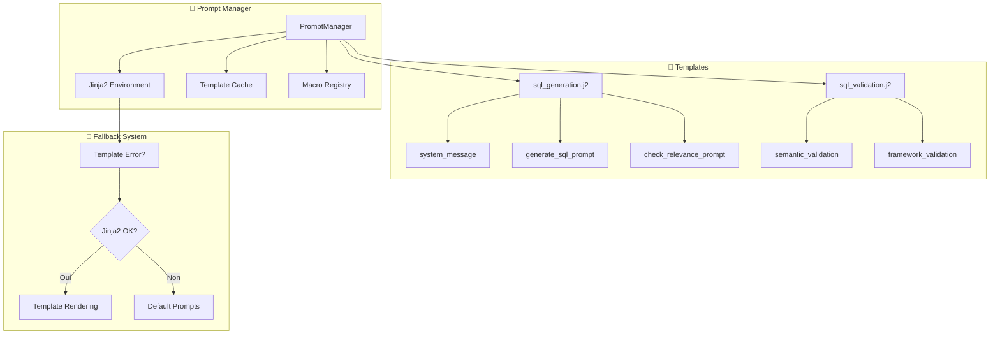
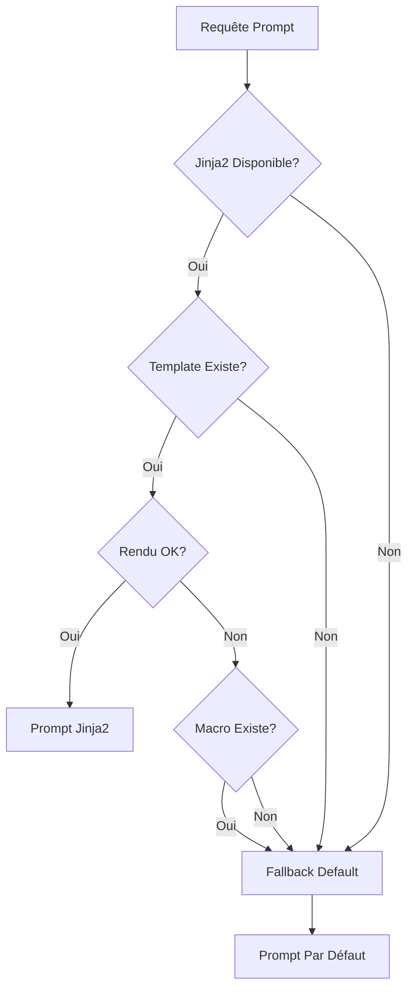

# 🎯 Système de Prompts Jinja2

Le système de prompts Jinja2 de NL2SQL API v2.0.0 révolutionne la gestion des prompts avec des **templates modulaires**, un **contexte dynamique** et une **personnalisation avancée** - tout en gardant un fallback robuste vers les prompts par défaut.

## 🌟 Innovation Majeure v2.0.0

### Avant vs Après

| Aspect | v1.x (Prompts Codés) | v2.0.0 (Jinja2 + Fallback) |
|--------|---------------------|----------------------------|
| **Maintenance** | Modification du code Python | Édition de templates `.j2` |
| **Personnalisation** | Redéploiement nécessaire | Modification à chaud |
| **Contexte** | Variables statiques | Contexte dynamique riche |
| **Réutilisabilité** | Code dupliqué | Macros réutilisables |
| **Testabilité** | Difficile à isoler | Templates testables séparément |
| **Fiabilité** | Risque de crash | Fallback automatique |

### Architecture Hybride Intelligente



## 🏗️ Architecture du Système

### PromptManager - Le Cœur du Système

**Localisation** : `app/prompts/prompt_manager.py`

**Fonctionnalités Clés** :
- 📄 **Chargement Templates** : Depuis `app/prompts/*.j2`
- 🏪 **Cache Intelligent** : Templates compilés en mémoire
- 🔍 **Validation Syntaxe** : Vérification templates au démarrage
- 🎯 **Rendu Contextualisé** : Variables dynamiques
- 🔙 **Fallback Gracieux** : Prompts par défaut si échec

**Initialisation Sécurisée** :
```python
class PromptManager:
    def __init__(self, templates_dir: str = "app/prompts"):
        self.templates_dir = Path(templates_dir)
        
        # Environment Jinja2 sécurisé
        self.env = Environment(
            loader=FileSystemLoader(self.templates_dir),
            autoescape=select_autoescape(['html', 'xml']),
            trim_blocks=True,
            lstrip_blocks=True,
            keep_trailing_newline=True
        )
        
        # Cache des templates compilés
        self._template_cache: Dict[str, Template] = {}
```

### Templates Principaux

#### 1. sql_generation.j2 - Génération SQL 🏗️

**Macros Disponibles** :
- `system_message()` - Message système pour le LLM
- `generate_sql_prompt()` - Prompt principal avec contexte
- `check_relevance_prompt()` - Vérification pertinence RH
- `explain_sql_prompt()` - Génération d'explications
- `auto_fix_prompt()` - Correction automatique
- `suggest_improvements_prompt()` - Suggestions d'amélioration

**Exemple d'Usage** :
```python
# Via PromptManager
prompt_manager = get_prompt_manager()
sql_prompt = prompt_manager.get_sql_generation_prompt(
    user_query="âge moyen collaborateurs",
    schema=schema_content,
    similar_queries=pinecone_results,
    context={
        "period_filter": "2023",
        "department_filter": "IT",
        "strict_mode": True
    }
)
```

#### 2. sql_validation.j2 - Validation 🔍

**Macros Disponibles** :
- `semantic_validation_prompt()` - Validation sémantique
- `framework_validation_prompt()` - Validation framework
- `performance_validation_prompt()` - Validation performance
- `business_validation_prompt()` - Validation métier RH
- `temporal_validation_prompt()` - Validation temporelle
- `validation_report_prompt()` - Rapport complet

## 📄 Anatomie d'un Template

### Structure Template sql_generation.j2

```jinja2
{# ========================================== #}
{# PROMPTS DE GÉNÉRATION SQL - NL2SQL API   #}
{# Version: 2.0.0                           #}
{# ========================================== #}

{# --- PROMPT SYSTÈME --- #}

Tu es un expert SQL spécialisé dans la traduction de langage naturel 
en requêtes SQL optimisées pour une base RH.

RÈGLES ABSOLUES :
1. Retourner UNIQUEMENT le code SQL
2. Filtre obligatoire : WHERE [alias_depot].ID_USER = ?
3. Table DEPOT toujours présente
4. Hashtags en fin : #DEPOT_[alias]# #FACTS_[alias]#
5. Seules les requêtes SELECT autorisées


{# --- PROMPT PRINCIPAL AVEC CONTEXTE --- #}

# MÉTHODE DE TRAVAIL PRIORITAIRE
1. EXAMINE la documentation de base de données
2. CONSULTE les requêtes similaires par score
3. ADAPTE la requête la plus pertinente
4. VÉRIFIE la conformité framework

# DOCUMENTATION COMPLÈTE
```
{{ schema }}
```


# REQUÊTES SIMILAIRES (PRIORITÉ PAR SCORE)




EXEMPLE {{ loop.index }} [{{ emphasis }} Score: {{ "%.2f"|format(query.score) }}]
Question: "{{ query.metadata.get('texte_complet', '') }}"
SQL: 
```sql
{{ query.metadata.get('requete', 'N/A') }}
```




# REQUÊTE À TRADUIRE
Question: "{{ user_query }}"


**Contexte temporel :** {{ context.period_filter }}



**Contexte département :** {{ context.department_filter }}



**Mode strict activé** : Validation renforcée


SQL:

```

### Fonctionnalités Jinja2 Utilisées

**1. Variables et Contexte** :
```jinja2
{{ user_query }}                    {# Variable simple #}
{{ context.period_filter }}         {# Variable d'objet #}
{{ "%.2f"|format(query.score) }}   {# Filtre de formatage #}
```

**2. Structures de Contrôle** :
```jinja2

  {# Rendu conditionnel #}



  {# Boucle avec accès loop.index #}

```

**3. Filtres et Fonctions** :
```jinja2
{{ similar_queries|sort(attribute='score', reverse=true)|list }}

```

**4. Macros Réutilisables** :
```jinja2

  {# Contenu réutilisable #}


{# Appel de macro #}
{{ system_message() }}
```

## 🎯 Contexte Dynamique Avancé

### Types de Contexte Supportés

#### 1. Contexte Temporel 📅
```python
context = {
    "period_filter": "2023",
    "start_date": "2023-01-01",
    "end_date": "2023-12-31",
    "fiscal_year": "2023"
}
```

**Rendu Template** :
```jinja2

**Période d'analyse :** {{ context.period_filter }}

```

#### 2. Contexte Organisationnel 🏢
```python
context = {
    "department_filter": "IT",
    "entity_filter": "SIRET_123456789",
    "region_filter": "Ile-de-France",
    "site_filter": "Paris"
}
```

#### 3. Contexte Technique ⚙️
```python
context = {
    "strict_mode": True,
    "validation_level": "enhanced",
    "performance_mode": "optimized",
    "debug_mode": False
}
```

#### 4. Contexte Métier 💼
```python
context = {
    "business_domain": "HR",
    "use_case": "reporting",
    "target_audience": "manager",
    "detail_level": "summary"
}
```

### Contexte Intelligent par Type de Requête

**Génération SQL** :
```python
sql_context = {
    "period": self._extract_period_from_query(user_query),
    "department": self._extract_department_from_query(user_query),
    "strict_mode": True,
    "analysis_type": "descriptive"
}
```

**Validation Sémantique** :
```python
validation_context = {
    "strict_mode": True,
    "business_domain": "HR", 
    "validation_level": "semantic",
    "schema_validation": True
}
```

**Explication** :
```python
explanation_context = {
    "target_audience": "non-technique",
    "detail_level": "simple",
    "language": "french",
    "include_examples": True
}
```

## 🔄 Système de Fallback Robuste

### Stratégie Multi-Niveaux



### Implémentation Fallback

**Dans LLMFactory** :
```python
async def generate_sql(self, user_query: str, schema: str, **kwargs):
    try:
        # Tentative Jinja2
        if self.prompt_manager:
            system_content = self.prompt_manager.get_system_message()
            user_content = self.prompt_manager.get_sql_generation_prompt(
                user_query=user_query,
                schema=schema,
                similar_queries=similar_queries,
                context=context
            )
        else:
            # Fallback automatique
            system_content, user_content = self._build_fallback_sql_prompt(
                user_query, schema, similar_queries
            )
    except Exception as e:
        logger.warning(f"Erreur Jinja2, fallback: {e}")
        system_content, user_content = self._build_fallback_sql_prompt(
            user_query, schema, similar_queries
        )
```

**Prompts de Fallback Intégrés** :
```python
def _build_fallback_sql_prompt(self, user_query, schema, similar_queries):
    system_message = (
        "Tu es un expert SQL spécialisé dans la traduction de langage naturel "
        "en requêtes SQL optimisées. Tu dois retourner UNIQUEMENT le code SQL, "
        "sans explications ni formatage markdown."
    )
    
    prompt = f"""
Traduis cette question en SQL:

Question: {user_query}

Schéma:
{schema}

RÈGLES OBLIGATOIRES:
1. Inclure WHERE [alias_depot].ID_USER = ?
2. Joindre avec la table DEPOT
3. Ajouter hashtags en fin : #DEPOT_alias# #FACTS_alias#

SQL:"""
    
    return system_message, prompt
```

## 🛠️ API du PromptManager

### Méthodes Principales

#### 1. Gestion des Templates
```python
# Lister templates disponibles
templates = prompt_manager.list_available_templates()
# ['sql_generation.j2', 'sql_validation.j2']

# Lister macros d'un template  
macros = prompt_manager.list_template_macros('sql_generation.j2')
# ['system_message', 'generate_sql_prompt', 'check_relevance_prompt']

# Valider syntaxe d'un template
is_valid = prompt_manager.validate_template_syntax('sql_generation.j2')
```

#### 2. Rendu de Prompts
```python
# Rendu d'une macro spécifique
rendered = prompt_manager.render_macro(
    'sql_generation.j2', 
    'generate_sql_prompt',
    user_query="âge moyen",
    schema=schema_content,
    context={"strict_mode": True}
)

# Rendu avec fallback automatique
safe_rendered = prompt_manager.render_with_fallback(
    'sql_generation.j2',
    'generate_sql_prompt', 
    fallback_text="Prompt par défaut en cas d'erreur",
    **kwargs
)
```

#### 3. Méthodes Spécialisées
```python
# Messages système
system_msg = prompt_manager.get_system_message()

# Génération SQL
sql_prompt = prompt_manager.get_sql_generation_prompt(
    user_query, schema, similar_queries, context
)

# Validation sémantique
validation_prompt = prompt_manager.get_semantic_validation_prompt(
    sql_query, original_request, schema, context
)

# Explications
explanation_prompt = prompt_manager.get_explanation_prompt(
    sql_query, original_request, context
)
```

## 🧪 Testing et Validation

### Tests de Templates

```python
# Test de syntaxe
def test_template_syntax():
    prompt_manager = get_prompt_manager()
    templates = prompt_manager.list_available_templates()
    
    for template in templates:
        assert prompt_manager.validate_template_syntax(template)

# Test de rendu
def test_sql_prompt_rendering():
    prompt_manager = get_prompt_manager()
    
    rendered = prompt_manager.render_macro(
        'sql_generation.j2',
        'generate_sql_prompt',
        user_query="test query",
        schema="test schema",
        similar_queries=[],
        context={"strict_mode": True}
    )
    
    assert "test query" in rendered
    assert "strict_mode" in rendered
```

### Validation des Macros

```python
def test_all_macros_exist():
    prompt_manager = get_prompt_manager()
    
    required_macros = {
        'sql_generation.j2': [
            'system_message',
            'generate_sql_prompt',
            'check_relevance_prompt'
        ],
        'sql_validation.j2': [
            'semantic_validation_prompt',
            'framework_validation_prompt'
        ]
    }
    
    for template, expected_macros in required_macros.items():
        actual_macros = prompt_manager.list_template_macros(template)
        for macro in expected_macros:
            assert macro in actual_macros
```

## 🎛️ Configuration et Personnalisation

### Variables d'Environnement

```env
# Répertoire des templates (optionnel)
PROMPTS_TEMPLATES_DIR=app/prompts

# Mode debug pour les prompts
PROMPTS_DEBUG=true

# Fallback en cas d'erreur Jinja2
PROMPTS_FALLBACK_ENABLED=true
```

### Personnalisation des Templates

**1. Modification des Templates Existants** :
```bash
# Éditer le template principal
nano app/prompts/sql_generation.j2

# Redémarrage automatique en mode dev
# Rechargement à chaud des templates
```

**2. Ajout de Nouveaux Templates** :
```jinja2
{# app/prompts/custom_prompts.j2 #}

Validation personnalisée pour:
SQL: {{ sql_query }}

Règles spécifiques:

- {{ rule }}


```

**3. Utilisation des Templates Personnalisés** :
```python
# Enregistrement dynamique
prompt_manager.register_custom_template('custom_prompts.j2')

# Utilisation
custom_prompt = prompt_manager.render_macro(
    'custom_prompts.j2',
    'custom_validation_prompt',
    sql_query=sql,
    rules=["Règle 1", "Règle 2"]
)
```

## 📊 Monitoring et Métriques

### Health Check du Système

```python
async def get_prompts_health():
    """Vérifie l'état de santé du système de prompts."""
    try:
        prompt_manager = get_prompt_manager()
        templates = prompt_manager.list_available_templates()
        
        template_status = {}
        for template_name in templates:
            is_valid = prompt_manager.validate_template_syntax(template_name)
            macros = prompt_manager.list_template_macros(template_name)
            
            template_status[template_name] = {
                "valid": is_valid,
                "macros": macros,
                "macro_count": len(macros)
            }
        
        return {
            "status": "ok",
            "system": "jinja2", 
            "templates": template_status,
            "summary": {
                "total_templates": len(templates),
                "valid_templates": sum(1 for info in template_status.values() if info["valid"]),
                "total_macros": sum(info["macro_count"] for info in template_status.values())
            }
        }
    except ImportError:
        return {
            "status": "fallback",
            "system": "default",
            "message": "Prompts par défaut utilisés"
        }
```

### Métriques d'Usage

```python
# Dans PromptManager
self.stats = {
    "template_loads": 0,
    "cache_hits": 0,
    "render_calls": 0,
    "fallback_uses": 0,
    "errors": 0
}

def get_usage_stats(self):
    return {
        "template_efficiency": self.stats["cache_hits"] / max(self.stats["template_loads"], 1),
        "fallback_rate": self.stats["fallback_uses"] / max(self.stats["render_calls"], 1),
        "error_rate": self.stats["errors"] / max(self.stats["render_calls"], 1)
    }
```

## 🚀 Cas d'Usage Avancés

### 1. Templates Spécialisés par Domaine

**Template Finance** :
```jinja2

# CONTEXTE FINANCIER
Domaine: Analyse financière RH
Budget: {{ context.budget_year }}
Devise: {{ context.currency|default('EUR') }}

Question: {{ user_query }}

Contraintes spécifiques finance:
- Arrondir montants à 2 décimales
- Inclure TVA si applicable
- Respecter exercice fiscal

SQL:

```

### 2. Templates Multi-Langues

```jinja2


You are an SQL expert specialized in natural language to SQL translation.

Eres un experto SQL especializado en traducir lenguaje natural a SQL.

Tu es un expert SQL spécialisé dans la traduction de langage naturel en SQL.


```

### 3. Templates Contextuels Dynamiques

```jinja2





# MODE SIMPLIFIÉ
Génère une requête SQL basique pour:

# MODE EXPERT  
Crée une requête SQL optimisée avec:
- Fonctions de fenêtrage si nécessaire
- Optimisations de performance
- Gestion des cas limites


Question: {{ user_query }}


Privilégier la lisibilité du résultat.

Optimiser pour les performances.


```

## 🔮 Évolutions Futures

### Fonctionnalités Prévues

1. **Templates Dynamiques** : Génération de templates via IA
2. **Versioning** : Gestion des versions de templates
3. **A/B Testing** : Test automatique de différents prompts
4. **Analytics** : Analyse de performance par template
5. **Hot Reload** : Rechargement sans redémarrage

### Intégrations Prévues

1. **Base de Données** : Templates stockés en BDD
2. **API REST** : Gestion templates via API
3. **Interface Web** : Éditeur visuel de templates
4. **Git Integration** : Versioning avec Git
5. **CI/CD** : Validation automatique dans pipeline

## 💡 Bonnes Pratiques

### ✅ Do's

1. **Macros Modulaires** : Une macro = une responsabilité
2. **Variables Contextuelles** : Utiliser le contexte dynamique
3. **Validation Systématique** : Tester syntaxe et rendu
4. **Fallback Toujours** : Prévoir prompts par défaut
5. **Documentation** : Commenter les templates complexes

### ❌ Don'ts

1. **Logique Complexe** : Éviter trop de conditions dans templates
2. **Variables Hardcodées** : Utiliser le contexte dynamique
3. **Templates Monolithiques** : Préférer plusieurs macros
4. **Pas de Fallback** : Toujours avoir un plan B
5. **Pas de Tests** : Valider systématiquement

## 📚 Ressources et Documentation

### Code Source
- `app/prompts/prompt_manager.py` - Gestionnaire principal
- `app/prompts/sql_generation.j2` - Template génération SQL
- `app/prompts/sql_validation.j2` - Template validation
- `app/prompts/__init__.py` - Interface publique

### Endpoints API
- `GET /api/v1/prompts/templates` - Liste des templates
- `POST /api/v1/prompts/render-test` - Test de rendu
- `GET /api/v1/prompts/health` - Santé du système

### Documentation Jinja2
- [Jinja2 Documentation](https://jinja.palletsprojects.com/)
- [Template Designer Documentation](https://jinja.palletsprojects.com/en/3.0.x/templates/)
- [API Documentation](https://jinja.palletsprojects.com/en/3.0.x/api/)

---

## 🎯 Navigation

**Précédent** : [Multi-LLM Factory](Multi-LLM-Factory)  
**Suivant** : [Framework de Sécurité](Security-Framework)

**Voir aussi** :
- [Service Layer Architecture](Service-Layer-Architecture) - Architecture globale
- [Multi-LLM Factory](Multi-LLM-Factory) - Intégration avec Factory
- [Configuration Guide](Configuration-Guide) - Variables d'environnement

---

*Le Système de Prompts Jinja2 de NL2SQL API v2.0.0 apporte la flexibilité et la puissance des templates modernes à l'IA conversationnelle.* 🎯✨