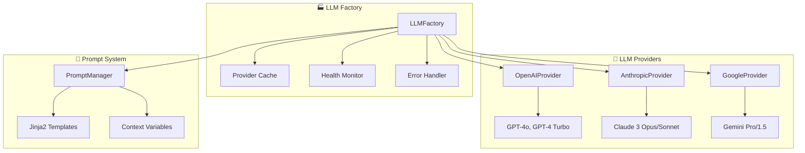

# 🏭 Multi-LLM Factory Pattern

Le système Multi-LLM Factory de NL2SQL API v2.0.0 offre une **abstraction unifiée** pour gérer plusieurs fournisseurs d'IA (OpenAI, Anthropic, Google) avec une interface commune et une gestion d'erreurs centralisée.

## 🎯 Vue d'Ensemble

### Pourquoi un Factory Pattern ?

Le **Factory Pattern** résout plusieurs défis :
- 🔌 **Abstraction** : Interface unique pour tous les LLM
- 🔄 **Flexibilité** : Changement de provider sans modification de code
- 🏪 **Cache d'instances** : Réutilisation des providers configurés
- 🛡️ **Gestion d'erreurs** : Handling unifié des exceptions
- 📊 **Monitoring** : Health checks centralisés

### Architecture Globale


```mermaid
graph TB
    subgraph "🏭 LLM Factory"
        A[LLMFactory] --> B[Provider Cache]
        A --> C[Health Monitor]
        A --> D[Error Handler]
    end
    
    subgraph "🤖 LLM Providers"
        E[OpenAIProvider] --> F[GPT-4o, GPT-4 Turbo]
        G[AnthropicProvider] --> H[Claude 3 Opus/Sonnet]
        I[GoogleProvider] --> J[Gemini Pro/1.5]
    end
    
    subgraph "🎯 Prompt System"
        K[PromptManager] --> L[Jinja2 Templates]
        K --> M[Context Variables]
    end
    
    A --> E
    A --> G
    A --> I
    A --> K
```

## 🏗️ Architecture Détaillée

### LLMFactory - Le Cœur du Système

**Localisation** : `app/core/llm_factory.py`

**Responsabilités Principales** :
- 🏪 **Gestion des Providers** : Création et cache des instances
- 🎯 **Interface Unifiée** : Méthodes communes pour tous LLM
- 🧠 **Génération SQL** : Avec support Jinja2 et contexte
- ✅ **Validation Sémantique** : Vérification correspondance requête/SQL
- 📖 **Explications** : Génération d'explications en français
- 🔍 **Vérification Pertinence** : Filtrage domaine RH
- 🏥 **Health Checks** : Surveillance de tous les providers

**Mapping des Providers** :
```python
_PROVIDER_CLASSES = {
    "openai": OpenAIProvider,
    "anthropic": AnthropicProvider,
    "google": GoogleProvider
}
```

### Interface Unifiée - BaseLLMProvider

**Contrat Commun** pour tous les providers :

```python
class BaseLLMProvider(ABC):
    @abstractmethod
    async def generate_completion(
        self, 
        messages: List[Dict[str, str]], 
        model: Optional[str] = None,
        **kwargs
    ) -> str:
        """Génère une completion à partir des messages."""
        pass
    
    @abstractmethod
    async def health_check(self) -> Dict[str, Any]:
        """Vérifie l'état de santé du provider."""
        pass
    
    @abstractmethod
    def get_available_models(self) -> List[Dict[str, str]]:
        """Retourne la liste des modèles disponibles."""
        pass
```

## 🤖 Providers LLM Détaillés

### 1. OpenAI Provider 🚀

**Modèles Supportés** :
| Modèle | Nom Complet | Context Length | Usage Recommandé |
|--------|-------------|----------------|------------------|
| `gpt-4o` | GPT-4o | 128,000 tokens | **Production** - Équilibre qualité/vitesse |
| `gpt-4o-mini` | GPT-4o Mini | 128,000 tokens | **Développement** - Économique |
| `gpt-4-turbo` | GPT-4 Turbo | 128,000 tokens | **Complexe** - Requêtes avancées |
| `gpt-4` | GPT-4 | 8,192 tokens | **Standard** - Qualité éprouvée |
| `gpt-3.5-turbo` | GPT-3.5 Turbo | 16,385 tokens | **Rapide** - Tests et prototypage |

**Configuration** :
```python
# Headers OpenAI
headers = {
    "Content-Type": "application/json",
    "Authorization": f"Bearer {self.config.OPENAI_API_KEY}"
}

# Payload spécifique
payload = {
    "model": model,
    "messages": messages,
    "temperature": temperature,
    "max_tokens": max_tokens
}
```

**Gestion d'Erreurs Spécialisée** :
```python
if response.status == 401:
    raise LLMAuthError("openai", "Clé API invalide ou expirée")
elif response.status == 429:
    retry_after = response.headers.get("Retry-After", "60")
    raise LLMQuotaError("openai", f"Limite dépassée. Retry dans {retry_after}s")
```

### 2. Anthropic Provider 🧠

**Modèles Claude** :
| Modèle | Nom Complet | Context Length | Spécialité |
|--------|-------------|----------------|------------|
| `claude-3-opus-20240229` | Claude 3 Opus | 200,000 tokens | **Expert** - Raisonnement complexe |
| `claude-3-sonnet-20240229` | Claude 3 Sonnet | 200,000 tokens | **Équilibré** - Usage général |
| `claude-3-haiku-20240307` | Claude 3 Haiku | 200,000 tokens | **Rapide** - Réponses concises |
| `claude-3-5-sonnet-20241022` | Claude 3.5 Sonnet | 200,000 tokens | **Amélioré** - Dernière version |

**Conversion Format Messages** :
```python
def _convert_messages_to_anthropic_format(self, messages):
    system_message = ""
    anthropic_messages = []
    
    for message in messages:
        if message["role"] == "system":
            system_message = message["content"]
        elif message["role"] == "user":
            anthropic_messages.append({
                "role": "user", 
                "content": message["content"]
            })
```

**Payload Claude** :
```python
payload = {
    "model": model,
    "messages": anthropic_messages,
    "system": system_message,  # Spécificité Claude
    "temperature": temperature,
    "max_tokens": max_tokens
}
```

### 3. Google Provider 🌟

**Modèles Gemini** :
| Modèle | Nom Complet | Context Length | Innovation |
|--------|-------------|----------------|------------|
| `gemini-pro` | Gemini Pro | 32,768 tokens | **Standard** - Production stable |
| `gemini-1.5-pro` | Gemini 1.5 Pro | 1,000,000 tokens | **Ultra-long** - Documents massifs |
| `gemini-1.5-flash` | Gemini 1.5 Flash | 1,000,000 tokens | **Ultra-rapide** - Latence minimale |

**Format Gemini Spécifique** :
```python
def _convert_messages_to_gemini_format(self, messages):
    gemini_messages = []
    system_content = None
    
    for message in messages:
        if message["role"] == "system":
            system_content = message["content"]
        elif message["role"] == "user":
            # Intégrer système dans premier message user
            if system_content:
                content = f"Instructions: {system_content}\n\nUser: {message['content']}"
                system_content = None
            else:
                content = message["content"]
            
            gemini_messages.append({
                "role": "user",
                "parts": [{"text": content}]
            })
```

**URL avec Clé API** :
```python
url = (
    f"https://generativelanguage.googleapis.com/v1beta/models/{model}:"
    f"generateContent?key={self.config.GOOGLE_API_KEY}"
)
```

## 🎯 Intégration Prompts Jinja2

### Support des Templates Modulaires

**Génération SQL avec Contexte** :
```python
async def generate_sql(
    self,
    user_query: str,
    schema: str,
    similar_queries: Optional[List[Dict]] = None,
    provider: Optional[str] = None,
    model: Optional[str] = None,
    temperature: Optional[float] = None,
    context: Optional[Dict[str, Any]] = None  # 🆕 Support contexte
) -> str:
    try:
        # Tentative PromptManager Jinja2
        if self.prompt_manager:
            system_content = self.prompt_manager.get_system_message()
            user_content = self.prompt_manager.get_sql_generation_prompt(
                user_query=user_query,
                schema=schema,
                similar_queries=similar_queries or [],
                context=context or {}  # 🎯 Contexte dynamique
            )
        else:
            # Fallback prompts par défaut
            system_content, user_content = self._build_fallback_sql_prompt(
                user_query, schema, similar_queries or []
            )
```

**Contexte Enrichi** :
```python
context = {
    "period_filter": "2023",
    "department_filter": "IT", 
    "strict_mode": True,
    "business_domain": "HR"
}
```

### Fallback Automatique

Si Jinja2 échoue, utilisation des **prompts codés en dur** :

```python
def _build_fallback_sql_prompt(
    self, 
    user_query: str, 
    schema: str, 
    similar_queries: List[Dict]
) -> tuple[str, str]:
    system_message = (
        "Tu es un expert SQL spécialisé dans la traduction de langage naturel "
        "en requêtes SQL optimisées..."
    )
    
    prompt = f"""
Traduis cette question en SQL:

Question: {user_query}

Schéma: {schema}

Règles ABSOLUES:
1. Inclure WHERE [alias_depot].ID_USER = ?
2. Joindre avec table DEPOT
3. Ajouter hashtags en fin

SQL:"""
    
    return system_message, prompt
```

## 🔍 Méthodes Factory Avancées

### 1. Validation Sémantique

**Vérification Correspondance Requête/SQL** :
```python
async def validate_sql_semantically(
    self,
    sql_query: str,
    original_request: str,
    schema: str,
    provider: Optional[str] = None,
    model: Optional[str] = None,
    context: Optional[Dict[str, Any]] = None
) -> tuple[bool, str]:
    # Prompt via Jinja2 ou fallback
    if self.prompt_manager:
        prompt_content = self.prompt_manager.get_semantic_validation_prompt(
            sql_query=sql_query,
            original_request=original_request,
            schema=schema,
            context=context or {}
        )
    
    # Analyse via LLM
    response = await self.generate_completion(messages, provider, model)
    
    # Parsing réponse
    if "OUI" in response.upper():
        return True, "SQL correspond à la demande"
    elif "NON" in response.upper():
        return False, "SQL ne correspond pas"
    else:
        return True, "Correspondance probable"
```

### 2. Génération d'Explications

**Explications Contextualisées** :
```python
async def explain_sql(
    self,
    sql_query: str,
    original_request: str,
    provider: Optional[str] = None,
    model: Optional[str] = None,
    context: Optional[Dict[str, Any]] = None
) -> str:
    # Contexte pour l'explication
    explanation_context = context or {}
    explanation_context.update({
        "target_audience": "non-technique",
        "detail_level": "simple",
        "language": "french"
    })
    
    # Génération via templates
    if self.prompt_manager:
        prompt_content = self.prompt_manager.get_explanation_prompt(
            sql_query=sql_query,
            original_request=original_request,
            context=explanation_context
        )
```

### 3. Vérification de Pertinence

**Filtrage Domaine RH** :
```python
async def check_relevance(
    self,
    user_query: str,
    provider: Optional[str] = None,
    model: Optional[str] = None
) -> bool:
    # Prompt spécialisé RH
    if self.prompt_manager:
        prompt_content = self.prompt_manager.get_relevance_check_prompt(user_query)
    else:
        prompt_content = f"""
Tu détermines si cette question concerne les RH:

Base RH contient: employés, contrats, salaires, absences, formations

Question: "{user_query}"

Réponds UNIQUEMENT par "OUI" ou "NON".
"""
    
    response = await self.generate_completion(messages, provider, model)
    return "OUI" in response.upper()
```

## 🔄 Gestion des Erreurs Multi-Provider

### Hiérarchie d'Exceptions

```python
# Exceptions spécialisées par type d'erreur
try:
    result = await factory.generate_sql(...)
except LLMAuthError as e:
    # Clé API invalide - erreur critique
    logger.error(f"[{e.provider}] Auth error: {e.message}")
    raise HTTPException(status_code=401)
except LLMQuotaError as e:
    # Limite dépassée - retry avec autre provider
    logger.warning(f"[{e.provider}] Quota exceeded, trying fallback")
    # Automatiquement essayer avec provider alternatif
except LLMNetworkError as e:
    # Erreur réseau - retry avec backoff
    logger.warning(f"[{e.provider}] Network error, retrying...")
    # HTTPClient gère le retry automatique
```

### Retry Multi-Provider

**Stratégie de Fallback** :
```python
async def generate_sql_with_fallback(self, user_query: str, **kwargs):
    providers = ["openai", "anthropic", "google"]
    
    for provider in providers:
        try:
            return await self.generate_sql(
                user_query=user_query,
                provider=provider,
                **kwargs
            )
        except LLMQuotaError:
            logger.info(f"Provider {provider} quota exceeded, trying next")
            continue
        except LLMAuthError:
            logger.info(f"Provider {provider} not configured, trying next")
            continue
    
    raise LLMError("all_providers", "Tous les providers ont échoué")
```

## 🏥 Health Checks Centralisés

### Surveillance Multi-Provider

```python
async def health_check_all(self) -> Dict[str, Any]:
    results = {}
    
    # Tester chaque provider disponible
    for provider_name in self._PROVIDER_CLASSES:
        try:
            provider = await self.get_provider(provider_name)
            results[provider_name] = await provider.health_check()
        except LLMConfigError as e:
            results[provider_name] = {
                "status": "not_configured",
                "provider": provider_name,
                "error": e.message
            }
    
    # Statut global
    default_provider = self.config.DEFAULT_PROVIDER
    global_status = "ok" if results.get(default_provider, {}).get("status") == "ok" else "error"
    
    return {
        "status": global_status,
        "default_provider": default_provider,
        "providers": results
    }
```

### Health Check par Provider

**OpenAI** :
```python
async def health_check(self) -> Dict[str, Any]:
    try:
        # Test léger avec GPT-3.5
        await self.generate_completion(
            [{"role": "user", "content": "test"}], 
            model="gpt-3.5-turbo",
            max_tokens=1
        )
        return {"status": "ok", "provider": "openai"}
    except Exception as e:
        return {"status": "error", "provider": "openai", "error": str(e)}
```

## 📊 Cache et Performance

### Cache des Instances Provider

**Pattern Singleton avec Thread Safety** :
```python
async def get_provider(self, provider_name: str) -> BaseLLMProvider:
    if provider_name not in self._provider_instances:
        async with self._initialization_lock:
            # Double-check pattern
            if provider_name not in self._provider_instances:
                provider_class = self._PROVIDER_CLASSES[provider_name]
                instance = provider_class(self.config, self.http_client)
                self._provider_instances[provider_name] = instance
    
    return self._provider_instances[provider_name]
```

### Optimisations HTTP

**Client HTTP Réutilisable** :
- Pool de connexions persistent
- Retry automatique avec backoff
- Timeout configurable par provider
- Gestion d'erreurs unifiée

## 🛠️ Configuration des Providers

### Variables d'Environnement

```env
# 🔑 Clés API
OPENAI_API_KEY=sk-...
ANTHROPIC_API_KEY=sk-ant-...
GOOGLE_API_KEY=AIza...

# 🤖 Modèles par défaut
DEFAULT_PROVIDER=openai
DEFAULT_OPENAI_MODEL=gpt-4o
DEFAULT_ANTHROPIC_MODEL=claude-3-opus-20240229
DEFAULT_GOOGLE_MODEL=gemini-pro

# ⚙️ Paramètres LLM
LLM_TEMPERATURE=0.2
LLM_TIMEOUT=30
```

### Validation de Configuration

```python
def _validate_config(self):
    """Valide la configuration du provider."""
    if not hasattr(self.config, 'OPENAI_API_KEY') or not self.config.OPENAI_API_KEY:
        raise LLMConfigError("openai", "OPENAI_API_KEY manquante")
    
    # Validation format clé
    if not self.config.OPENAI_API_KEY.startswith('sk-'):
        raise LLMConfigError("openai", "Format clé API OpenAI invalide")
```

## 🚀 Utilisation Pratique

### Cas d'Usage Courants

**1. Génération SQL Standard** :
```python
# Via le service
factory = LLMFactory(config)
sql = await factory.generate_sql(
    user_query="âge moyen collaborateurs",
    schema=schema_content,
    provider="openai"
)
```

**2. Avec Context et Requêtes Similaires** :
```python
sql = await factory.generate_sql(
    user_query="embauches 2023 par département",
    schema=schema_content,
    similar_queries=pinecone_results,
    context={
        "period": "2023",
        "department_filter": "ALL",
        "strict_mode": True
    },
    provider="anthropic",
    model="claude-3-opus-20240229"
)
```

**3. Validation + Explication** :
```python
# Validation sémantique
is_valid, msg = await factory.validate_sql_semantically(
    sql_query=generated_sql,
    original_request=user_query,
    schema=schema_content
)

# Génération explication
if is_valid:
    explanation = await factory.explain_sql(
        sql_query=generated_sql,
        original_request=user_query,
        context={"target_audience": "manager"}
    )
```

## 🔮 Extensions Futures

### Nouveaux Providers

**Ajout Mistral AI** :
```python
class MistralProvider(BaseLLMProvider):
    AVAILABLE_MODELS = [
        {"id": "mistral-large", "name": "Mistral Large"},
        {"id": "mistral-medium", "name": "Mistral Medium"}
    ]
    
    async def generate_completion(self, messages, model=None, **kwargs):
        # Implémentation API Mistral
        pass

# Enregistrement automatique
_PROVIDER_CLASSES["mistral"] = MistralProvider
```

### Fonctionnalités Avancées

1. **Load Balancing** : Distribution automatique des requêtes
2. **Circuit Breaker** : Protection contre providers défaillants  
3. **Métriques Avancées** : Latence, coût, qualité par provider
4. **Cache Sémantique** : Cache basé sur similarité des requêtes
5. **A/B Testing** : Comparaison automatique de providers

## 📈 Avantages du Factory Pattern

### ✅ Bénéfices Directs

| Aspect | Sans Factory | Avec Factory |
|--------|--------------|--------------|
| **Ajout Provider** | Modification code partout | Une nouvelle classe |
| **Gestion Erreurs** | Dispersée et incohérente | Centralisée et uniforme |
| **Configuration** | Codée en dur | Dynamique via config |
| **Tests** | Difficiles (dépendances) | Faciles (mocks) |
| **Monitoring** | Manuel par provider | Automatique centralisé |

### 🎯 Flexibilité Opérationnelle

**Changement de Provider en Production** :
```env
# Passage d'OpenAI à Anthropic sans redéploiement
DEFAULT_PROVIDER=anthropic
DEFAULT_ANTHROPIC_MODEL=claude-3-opus-20240229
```

**Gestion des Pannes** :
```python
# Fallback automatique si provider principal en panne
try:
    result = await factory.generate_sql(query, provider="openai")
except LLMQuotaError:
    result = await factory.generate_sql(query, provider="anthropic")
```

## 📚 Ressources Complémentaires

### Code Source Principal
- `app/core/llm_factory.py` - Factory principale
- `app/core/llm_providers.py` - Implémentations providers
- `app/core/llm_service.py` - Service unifié (wrapper)
- `app/core/http_client.py` - Client HTTP optimisé

### Guides Connexes
- [Service Layer Architecture](Service-Layer-Architecture) - Architecture globale
- [Jinja2 Prompts System](Jinja2-Prompts-System) - Templates modulaires
- [Error Handling](Error-Handling) - Gestion d'erreurs centralisée
- [Configuration Guide](Configuration-Guide) - Variables d'environnement

---

## 🎯 Navigation

**Précédent** : [Service Layer Architecture](Service-Layer-Architecture)  
**Suivant** : [Système de Prompts Jinja2](Jinja2-Prompts-System)

**Voir aussi** :
- [Configuration Guide](Configuration-Guide) - Setup des providers
- [API Reference](API-Reference) - Utilisation via API
- [Error Handling](Error-Handling) - Gestion des erreurs LLM

---

*Le Multi-LLM Factory Pattern de NL2SQL API v2.0.0 offre une abstraction puissante et flexible pour gérer l'écosystème IA moderne.* 🏭🤖