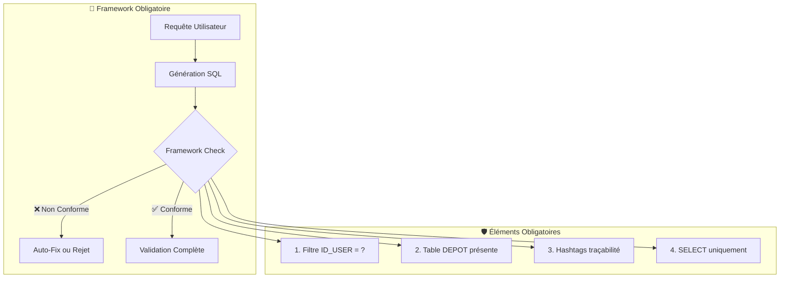
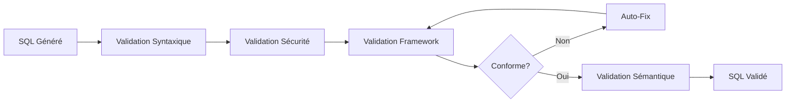

# 🛡️ Framework de Sécurité Obligatoire

Le framework de sécurité de NL2SQL API v2.0.0 implémente un **système multi-tenant robuste** avec des **règles obligatoires** pour garantir l'isolation des données et la sécurité des requêtes SQL générées.

## 🎯 Principe Fondamental

### Architecture Multi-Tenant Sécurisée

**Chaque requête SQL générée DOIT OBLIGATOIREMENT** respecter le framework de sécurité pour :
- 🔒 **Isolation des données** : Un utilisateur ne peut accéder qu'à ses propres données
- 🛡️ **Prévention des fuites** : Aucun accès transversal entre utilisateurs
- 📊 **Traçabilité** : Suivi complet des accès aux données
- 🚫 **Protection destructive** : Seules les requêtes SELECT autorisées

### Vue d'Ensemble



## 🏗️ Règles Obligatoires Détaillées

### 1. Filtre Utilisateur Obligatoire 🔑

**Règle** : Chaque requête DOIT inclure le filtre de sécurité utilisateur.

**Format Obligatoire** :
```sql
WHERE [alias_depot].ID_USER = ?
```

**Exemples Conformes** :
```sql
-- Avec alias 'a' pour DEPOT
WHERE a.ID_USER = ?

-- Avec alias 'depot' pour DEPOT  
WHERE depot.ID_USER = ?

-- Dans une jointure complexe
WHERE d.ID_USER = ? AND (...)
```

**❌ Exemples Non Conformes** :
```sql
-- Filtre manquant
SELECT * FROM facts;

-- Mauvaise syntaxe
WHERE ID_USER = 123;

-- Mauvaise table
WHERE facts.ID_USER = ?;
```

### 2. Table DEPOT Obligatoire 🏢

**Règle** : La table DEPOT doit TOUJOURS être présente pour l'authentification multi-tenant.

**Formats Acceptés** :
```sql
-- Direct avec alias
FROM depot a

-- Via JOIN (recommandé)
FROM facts b
INNER JOIN depot a ON a.ID = b.ID_NUMDEPOT

-- JOIN explicite
FROM entreprise e
JOIN depot d ON d.SIREN = e.SIREN
```

**❌ Exemples Non Conformes** :
```sql
-- Pas de table DEPOT
SELECT * FROM facts WHERE facts.ID_USER = ?;

-- Table DEPOT sans alias
FROM depot WHERE depot.ID_USER = ?;
```

### 3. Hashtags de Traçabilité 📊

**Règle** : Hashtags obligatoires en fin de requête pour la traçabilité.

**Format Obligatoire** :
```sql
#DEPOT_[alias]# [autres_hashtags]
```

**Hashtags Recommandés** :
- `#DEPOT_a#` - Table DEPOT avec alias 'a' (OBLIGATOIRE)
- `#FACTS_b#` - Table FACTS avec alias 'b'
- `#PERIODE#` - Filtres temporels utilisés
- `#ETABLISSEMENT#` - Filtres par établissement
- `#CONTRAT#` - Filtres par type de contrat

**Exemples Conformes** :
```sql
SELECT COUNT(*) FROM depot a 
INNER JOIN facts b ON a.ID = b.ID_NUMDEPOT 
WHERE a.ID_USER = ?;
#DEPOT_a# #FACTS_b#

-- Avec contexte temporel
SELECT b.NOM, b.PRENOM FROM depot a
INNER JOIN facts b ON a.ID = b.ID_NUMDEPOT
WHERE a.ID_USER = ? AND a.periode IN (#PERIODE#);
#DEPOT_a# #FACTS_b# #PERIODE#
```

### 4. Lecture Seule Stricte 📖

**Règle** : Seules les requêtes SELECT sont autorisées.

**✅ Opérations Autorisées** :
- `SELECT` - Lecture de données
- `WITH` - CTE (Common Table Expressions)
- `UNION` - Combinaison de résultats
- `EXPLAIN` - Analyse de requêtes

**❌ Opérations Interdites** :
- `INSERT` - Ajout de données
- `UPDATE` - Modification de données
- `DELETE` - Suppression de données
- `DROP` - Suppression de structures
- `ALTER` - Modification de structures
- `CREATE` - Création de structures
- `TRUNCATE` - Vidage de tables
- `EXECUTE` - Exécution de procédures

## 🔍 Validation Multi-Niveaux

### Pipeline de Validation



### 1. Validation Syntaxique

**Vérifications** :
- Structure SQL correcte
- Parenthèses équilibrées
- Guillemets équilibrés
- Mots-clés SQL valides

```python
def validate_sql_syntax(sql_query: str) -> Tuple[bool, str]:
    # Vérifier équilibre parenthèses
    if sql_query.count('(') != sql_query.count(')'):
        return False, "Parenthèses déséquilibrées"
    
    # Vérifier mots-clés SQL
    if not re.search(r'\b(SELECT|INSERT|UPDATE|DELETE)\b', sql_query, re.IGNORECASE):
        return False, "Aucun mot-clé SQL trouvé"
```

### 2. Validation Sécurité

**Détection Opérations Destructives** :
```python
FORBIDDEN_OPERATIONS = [
    r'^\s*DELETE\s+',
    r'^\s*DROP\s+', 
    r'^\s*TRUNCATE\s+',
    r'^\s*ALTER\s+',
    r'^\s*UPDATE\s+',
    r'^\s*INSERT\s+',
    r'^\s*CREATE\s+',
    r'EXECUTE\s+',
    r'EXEC\s+'
]
```

**Détection Injections SQL** :
```python
INJECTION_PATTERNS = [
    r';\s*DROP\s+',
    r';\s*DELETE\s+',
    r'UNION\s+SELECT.*FROM',
    r'--(?!\s*#)',  # Commentaires SQL (pas hashtags)
    r'/\*.*\*/'
]
```

### 3. Validation Framework

**Analyse des Éléments** :
```python
def validate_framework(sql_query: str) -> Dict[str, bool]:
    elements = {
        "has_user_filter": bool(re.search(r'\b\w+\.ID_USER\s*=\s*\?', sql_query)),
        "has_depot_table": bool(re.search(r'\bDEPOT\s+\w+', sql_query)),
        "has_hashtags": bool(re.search(r'#\w+#', sql_query)),
        "is_select_query": sql_query.upper().strip().startswith('SELECT')
    }
    
    return elements
```

### 4. Correction Automatique

**Auto-Fix Framework** :
```python
def fix_framework_compliance(sql_query: str) -> str:
    # 1. Ajouter filtre ID_USER si manquant
    if not has_user_filter(sql_query):
        sql_query = add_user_filter(sql_query)
    
    # 2. Ajouter hashtags si manquants
    if not has_hashtags(sql_query):
        sql_query = add_hashtags(sql_query)
    
    return sql_query
```

## 🏛️ Exemples de Requêtes Conformes

### Requête Simple Conforme

```sql
SELECT COUNT(*) AS nb_employes
FROM depot a 
INNER JOIN facts b ON a.ID = b.ID_NUMDEPOT 
WHERE a.ID_USER = ? 
  AND b.NATURE_CONTRAT = '01'
  AND (b.FIN_CONTRAT = 'null' OR b.FIN_CONTRAT > a.datefin);
#DEPOT_a# #FACTS_b#
```

**✅ Analyse de Conformité** :
- ✅ Filtre `a.ID_USER = ?` présent
- ✅ Table DEPOT avec alias 'a'
- ✅ Hashtags `#DEPOT_a# #FACTS_b#`
- ✅ Requête SELECT uniquement

### Requête Complexe Conforme

```sql
SELECT 
    b.STATUT_CONVENTIONNEL,
    c.LIBELLE,
    b.SEXE,
    ROUND(AVG(TRUNCATE(b.AGE, 0)), 2) AS age_moyen,
    COUNT(*) AS effectif
FROM depot a 
INNER JOIN facts b ON a.ID = b.ID_NUMDEPOT 
LEFT OUTER JOIN referentiel c ON c.RUBRIQUE_DSN = 'S21.G00.40.002' 
    AND c.CODE = b.STATUT_CONVENTIONNEL 
WHERE a.ID_USER = ? 
  AND (b.FIN_CONTRAT = 'null' OR b.FIN_CONTRAT > a.datefin)
  AND CONCAT(SUBSTRING(a.periode, 5, 4), SUBSTRING(a.periode, 3, 2)) IN (
      SELECT MAX(CONCAT(SUBSTRING(w.periode, 5, 4), SUBSTRING(w.periode, 3, 2)))
      FROM depot w
      WHERE w.periode IN (#PERIODE#)
        AND w.id_user = a.id_user
  )
GROUP BY b.STATUT_CONVENTIONNEL, c.LIBELLE, b.SEXE
ORDER BY age_moyen DESC;
#DEPOT_a# #FACTS_b# #PERIODE#
```

**✅ Analyse Avancée** :
- ✅ Filtre principal `a.ID_USER = ?`
- ✅ Filtre cohérence dans sous-requête `w.id_user = a.id_user`
- ✅ Table DEPOT présente avec alias 'a'
- ✅ Hashtags appropriés avec contexte `#PERIODE#`
- ✅ Jointures sécurisées

### Requête avec Fonctions de Fenêtrage

```sql
SELECT
  T.LAST_STATUT_CONVENTIONNEL,
  c.LIBELLE,
  ROUND(SUM(T.LAST_ETP_CONTRAT), 2) AS total_etp
FROM (
  SELECT DISTINCT
    a.SIREN,
    a.nic,
    b.MATRICULE,
    FIRST_VALUE(b.STATUT_CONVENTIONNEL) OVER (
      PARTITION BY a.siren, a.nic, b.MATRICULE 
      ORDER BY a.DATEDEB DESC
    ) AS LAST_STATUT_CONVENTIONNEL,
    FIRST_VALUE(b.etp_contrat) OVER (
      PARTITION BY a.siren, a.nic, b.MATRICULE 
      ORDER BY a.DATEDEB DESC
    ) AS LAST_ETP_CONTRAT
  FROM depot a
  INNER JOIN facts b ON a.id = b.id_numdepot
  WHERE a.id_user = ? 
    AND b.nature_contrat = '01'
    AND (b.FIN_CONTRAT >= a.datedeb)
) AS T
LEFT JOIN referentiel c ON c.RUBRIQUE_DSN = 'S21.G00.40.002' 
  AND c.CODE = T.LAST_STATUT_CONVENTIONNEL
GROUP BY T.LAST_STATUT_CONVENTIONNEL, c.LIBELLE
ORDER BY total_etp DESC;
#DEPOT_a# #FACTS_b#
```

## ❌ Exemples Non Conformes et Corrections

### Cas 1 : Filtre Utilisateur Manquant

**❌ Non Conforme** :
```sql
SELECT COUNT(*) FROM facts WHERE nature_contrat = '01';
```

**🔧 Correction Automatique** :
```sql
SELECT COUNT(*) FROM depot a
INNER JOIN facts b ON a.ID = b.ID_NUMDEPOT
WHERE a.ID_USER = ? AND b.nature_contrat = '01';
#DEPOT_a# #FACTS_b#
```

### Cas 2 : Table DEPOT Manquante

**❌ Non Conforme** :
```sql
SELECT nom, prenom FROM facts WHERE facts.ID_USER = ?;
```

**🔧 Correction Automatique** :
```sql
SELECT b.nom, b.prenom 
FROM depot a
INNER JOIN facts b ON a.ID = b.ID_NUMDEPOT
WHERE a.ID_USER = ?;
#DEPOT_a# #FACTS_b#
```

### Cas 3 : Hashtags Manquants

**❌ Non Conforme** :
```sql
SELECT COUNT(*) FROM depot a 
INNER JOIN facts b ON a.ID = b.ID_NUMDEPOT 
WHERE a.ID_USER = ?;
```

**🔧 Correction Automatique** :
```sql
SELECT COUNT(*) FROM depot a 
INNER JOIN facts b ON a.ID = b.ID_NUMDEPOT 
WHERE a.ID_USER = ?;
#DEPOT_a# #FACTS_b#
```

### Cas 4 : Opération Destructive

**❌ Non Conforme** :
```sql
DELETE FROM facts WHERE age > 65;
```

**🚫 Rejet Total** : Aucune correction possible, requête rejetée.

## 🔧 Implémentation Technique

### ValidationService - Architecture

**Localisation** : `app/services/validation_service.py`

```python
class ValidationService:
    """Service unifié de validation avec framework obligatoire."""
    
    async def validate_complete(
        self, 
        sql_query: str,
        auto_fix: bool = True
    ) -> Dict[str, Any]:
        """Validation complète avec correction automatique."""
        
        # 1. Validation syntaxique
        syntax_valid, syntax_msg = self.validate_sql_syntax(sql_query)
        
        # 2. Validation sécurité  
        security_safe, security_msg = self.validate_security(sql_query)
        
        # 3. Validation framework
        framework_compliant, framework_msg, details = self.validate_framework(sql_query)
        
        # 4. Correction automatique si nécessaire
        if not framework_compliant and auto_fix:
            corrected_query = self.fix_framework_compliance(sql_query)
            # Re-validation après correction
            framework_compliant, framework_msg, details = self.validate_framework(corrected_query)
```

### Patterns de Validation

**Framework Patterns** :
```python
FRAMEWORK_PATTERNS = {
    'user_filter': r'\b\w+\.ID_USER\s*=\s*\?',
    'depot_table': r'\bDEPOT\s+\w+',
    'hashtags': r'#\w+#',
    'join_depot': r'\bJOIN\s+DEPOT\b'
}
```

**Correction Patterns** :
```python
def add_user_filter(sql_query: str) -> str:
    """Ajoute le filtre ID_USER manquant."""
    depot_match = re.search(r'\bDEPOT\s+(\w+)', sql_query)
    if not depot_match:
        raise FrameworkError("Table DEPOT non trouvée")
    
    alias = depot_match.group(1)
    user_filter = f"{alias}.ID_USER = ?"
    
    # Insertion intelligente dans WHERE existant ou nouveau
    if ' WHERE ' in sql_query.upper():
        sql_query = re.sub(
            r'(\bWHERE\s+)', 
            f'\\1{user_filter} AND ', 
            sql_query, 
            flags=re.IGNORECASE
        )
```

## 🏥 Monitoring et Audit

### Métriques de Sécurité

```python
security_metrics = {
    "total_queries": 1000,
    "framework_compliant": 856,
    "auto_fixed": 144,
    "rejected": 0,
    "compliance_rate": 85.6,
    "auto_fix_success_rate": 100.0
}
```

### Logs de Sécurité

```python
# Log d'audit automatique
logger.security.info(
    f"Framework validation: query_id={query_id}, "
    f"user_id={user_id}, compliant={compliant}, "
    f"auto_fixed={auto_fixed}, elements={missing_elements}"
)
```

### Dashboard de Conformité

```json
{
    "period": "last_30_days",
    "compliance_overview": {
        "total_requests": 15420,
        "compliant_first_pass": 12890,
        "auto_fixed": 2530,
        "rejected": 0,
        "compliance_rate": 83.6
    },
    "framework_elements": {
        "user_filter_missing": 1845,
        "depot_table_missing": 312,
        "hashtags_missing": 892,
        "destructive_operations": 0
    }
}
```

## 🛡️ Cas d'Usage Spéciaux

### Requêtes Multi-Établissements

```sql
-- Conforme: Utilisateur peut voir ses multiple établissements
SELECT a.SIREN, a.NIC, COUNT(b.ID) as nb_employes
FROM depot a
INNER JOIN facts b ON a.ID = b.ID_NUMDEPOT
WHERE a.ID_USER = ?  -- Filtre utilisateur obligatoire
  AND a.SIREN IN ('123456789', '987654321')  -- Ses SIREN autorisés
GROUP BY a.SIREN, a.NIC;
#DEPOT_a# #FACTS_b#
```

### Requêtes Temporelles Complexes

```sql
-- Conforme: Évolution sur plusieurs périodes
SELECT 
    DATE_FORMAT(rp.DATEDEB, '%Y%m') as periode_format,
    COUNT(DISTINCT b.MATRICULE) as effectif
FROM referentiel_periode rp
INNER JOIN depot a ON rp.id_user = a.id_user AND rp.periode = a.periode
INNER JOIN facts b ON a.id = b.id_numdepot
WHERE a.ID_USER = ?  -- Filtre obligatoire même via referentiel_periode
  AND rp.periode IN (#PERIODE#)
  AND (b.FIN_CONTRAT = 'null' OR b.FIN_CONTRAT > rp.DATEDEB)
GROUP BY DATE_FORMAT(rp.DATEDEB, '%Y%m')
ORDER BY periode_format;
#DEPOT_a# #FACTS_b# #PERIODE#
```

### Requêtes avec Calculs Avancés

```sql
-- Conforme: Calculs complexes avec sécurité maintenue
WITH anciennete_calc AS (
    SELECT 
        a.ID_USER,
        b.MATRICULE,
        d.val_anc / IFNULL(f.libelle, 365.25) as anciennete_annees
    FROM depot a
    INNER JOIN facts b ON a.ID = b.ID_NUMDEPOT
    INNER JOIN facts_anc d ON b.id = d.id_FACT
    LEFT JOIN referentiel f ON f.rubrique_DSN = 'MESUREANCIENNETE' 
        AND ABS(d.UM_ANC) = ABS(f.code)
    WHERE a.ID_USER = ?  -- Filtre dans CTE aussi
      AND (b.fin_contrat = 'null' OR b.fin_contrat > a.datefin)
)
SELECT 
    CASE 
        WHEN anciennete_annees < 2 THEN 'Moins de 2 ans'
        WHEN anciennete_annees < 5 THEN '2 à 5 ans'
        WHEN anciennete_annees < 10 THEN '5 à 10 ans'
        ELSE 'Plus de 10 ans'
    END as tranche_anciennete,
    COUNT(*) as effectif,
    ROUND(AVG(anciennete_annees), 1) as anciennete_moyenne
FROM anciennete_calc
WHERE ID_USER = ?  -- Filtre maintenu dans requête principale
GROUP BY 
    CASE 
        WHEN anciennete_annees < 2 THEN 'Moins de 2 ans'
        WHEN anciennete_annees < 5 THEN '2 à 5 ans'
        WHEN anciennete_annees < 10 THEN '5 à 10 ans'
        ELSE 'Plus de 10 ans'
    END
ORDER BY 
    MIN(anciennete_annees);
#DEPOT_a# #FACTS_b#
```

## ⚠️ Limitations et Contraintes

### Limitations Techniques

1. **Pas de Procédures Stockées** : Exécution SQL pure uniquement
2. **Pas de DDL** : Aucune modification de structure
3. **Pas de DML** : Aucune modification de données
4. **Timeout** : 30 secondes maximum par requête
5. **Complexité** : Limitation sur la profondeur d'imbrication

### Contraintes Métier

1. **Multi-Tenant Strict** : Pas d'accès inter-utilisateurs
2. **Table DEPOT Obligatoire** : Pour toute requête
3. **Hashtags Requis** : Pour la traçabilité
4. **Lecture Seule** : Protection totale des données

## 🔮 Évolutions du Framework

### Améliorations Prévues

1. **Row-Level Security** : Sécurité au niveau ligne
2. **Dynamic Filtering** : Filtres contextuels automatiques
3. **Audit Avancé** : Traçabilité complète des accès
4. **Performance Optimization** : Optimisation des requêtes sécurisées
5. **Fine-Grained Permissions** : Permissions granulaires par table/colonne

### Règles Futures

1. **Column-Level Security** : Masquage automatique de colonnes sensibles
2. **Temporal Security** : Restrictions temporelles automatiques  
3. **Geographic Security** : Filtres géographiques selon l'utilisateur
4. **Role-Based Queries** : Requêtes adaptées au rôle utilisateur

---

## 🎯 Navigation

**Précédent** : [Configuration Guide](Configuration-Guide)  
**Suivant** : [Exemples d'Utilisation](Usage-Examples)

**Voir aussi** :
- [Service de Validation](Validation-Service) - Implémentation technique
- [Service Layer Architecture](Service-Layer-Architecture) - Architecture globale
- [API Reference](API-Reference) - Utilisation via API

---

*Framework de Sécurité NL2SQL API v2.0.0 - Protection multi-tenant robuste et transparente* 🛡️✨