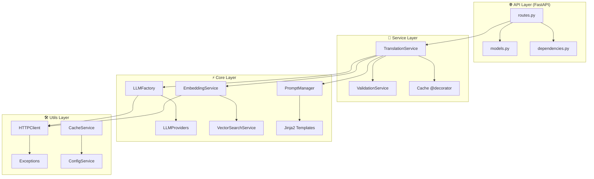
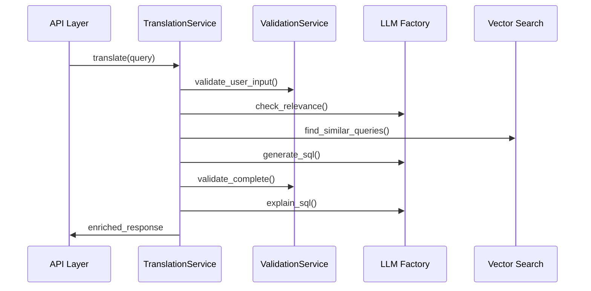
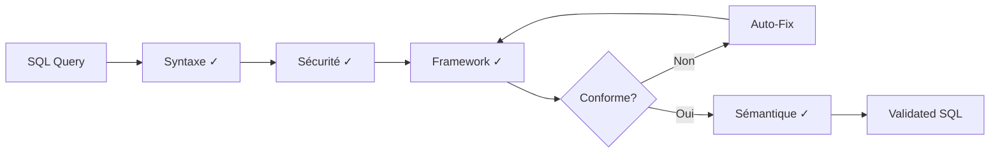
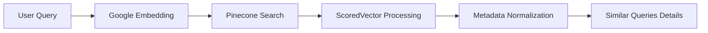

# 🏛️ Architecture Service Layer

L'architecture Service Layer de NL2SQL API v2.0.0 offre une **séparation claire des responsabilités** et une **maintenabilité exceptionnelle**. Cette page détaille le design pattern et son implémentation.

## 🎯 Vue d'Ensemble

### Qu'est-ce que le Service Layer Pattern ?

Le **Service Layer Pattern** est un pattern architectural qui :
- 🏗️ **Sépare** la logique métier des contrôleurs API
- 🔄 **Centralise** les opérations complexes dans des services dédiés
- 🧪 **Facilite** les tests unitaires et l'injection de dépendances
- 📈 **Améliore** la réutilisabilité et la maintenabilité

### Architecture Globale



## 🔧 Services Principaux

### 1. TranslationService 🎯

**Rôle** : Orchestrateur principal de la traduction NL2SQL

**Localisation** : `app/services/translation_service.py`

**Responsabilités** :
- 🔍 Orchestration complète du processus de traduction
- ✅ Validation des entrées utilisateur
- 🧠 Vérification de pertinence RH via LLM
- 🔍 Recherche vectorielle dans Pinecone
- 🤖 Génération SQL via LLM Factory
- ✅ Validation complète (framework + sémantique)
- 💾 Gestion du cache avec décorateur
- 📊 Formatage des réponses enrichies

**Méthode Principale** :
```python
@cache_service_method(ttl=3600, key_prefix="translation")
async def translate(
    self,
    user_query: str,
    schema_path: Optional[str] = None,
    validate: bool = True,
    explain: bool = True,
    provider: Optional[str] = None,
    model: Optional[str] = None,
    use_cache: bool = True,
    include_similar_details: bool = False,
    **kwargs
) -> Dict[str, Any]:
```

**Flux de Traitement** :


### 2. ValidationService ✅

**Rôle** : Service unifié de validation multi-niveaux

**Localisation** : `app/services/validation_service.py`

**Responsabilités** :
- 🔍 **Validation Syntaxique** : Structure SQL correcte
- 🛡️ **Validation Sécurité** : Détection opérations destructives
- 🏗️ **Validation Framework** : Respect règles obligatoires
- 🧠 **Validation Sémantique** : Correspondance via LLM
- 🔧 **Correction Automatique** : Auto-fix framework compliance
- 📋 **Suggestions** : Recommandations d'amélioration

**Méthodes Clés** :
```python
async def validate_complete(
    self, 
    sql_query: str, 
    original_request: str = None,
    schema: str = None,
    auto_fix: bool = True
) -> Dict[str, Any]:

def validate_framework(self, sql_query: str) -> Tuple[bool, str, Dict]:

def fix_framework_compliance(self, sql_query: str) -> str:
```

**Pipeline de Validation** :


## 🏭 Factory Pattern - LLM Management

### LLMFactory 🏭

**Rôle** : Factory pour créer et gérer les providers LLM

**Localisation** : `app/core/llm_factory.py`

**Avantages** :
- 🔌 **Abstraction** : Interface unifiée pour tous LLM
- 🔄 **Extensibilité** : Ajout facile de nouveaux providers
- 🏪 **Cache d'instances** : Réutilisation des providers
- 🔍 **Health checks** : Surveillance centralisée
- 🎯 **Prompts Jinja2** : Support templates modulaires

**Providers Supportés** :
```python
_PROVIDER_CLASSES = {
    "openai": OpenAIProvider,
    "anthropic": AnthropicProvider, 
    "google": GoogleProvider
}
```

**Utilisation** :
```python
# Récupération d'un provider
provider = await factory.get_provider("openai")

# Génération SQL avec contexte
sql = await factory.generate_sql(
    user_query="âge moyen collaborateurs",
    schema=schema,
    similar_queries=results,
    context={"period": "2023", "strict_mode": True}
)
```

### Providers LLM 🤖

**Interface Commune** : `BaseLLMProvider`

**Implémentations** :
- **OpenAIProvider** : GPT-4o, GPT-4 Turbo, GPT-3.5 Turbo
- **AnthropicProvider** : Claude 3 Opus, Sonnet, Haiku
- **GoogleProvider** : Gemini Pro, Gemini 1.5 Pro/Flash

**Gestion d'Erreurs Unifiée** :
```python
try:
    result = await provider.generate_completion(messages)
except LLMAuthError:
    # Clé API invalide
except LLMQuotaError:
    # Limite dépassée
except LLMNetworkError:
    # Problème réseau - retry automatique
```

## 🎯 Système de Prompts Jinja2

### PromptManager 📝

**Innovation** : Templates modulaires et personnalisables

**Localisation** : `app/prompts/prompt_manager.py`

**Fonctionnalités** :
- 📄 **Templates** : `sql_generation.j2`, `sql_validation.j2`
- 🔄 **Contexte Dynamique** : Variables adaptables
- 🏪 **Cache** : Templates compilés
- 🔙 **Fallback** : Prompts par défaut si Jinja2 échoue

**Exemple de Template** :
```jinja2

Tu es un expert SQL spécialisé dans la traduction de langage naturel.

Question: {{ user_query }}


Contexte temporel: {{ context.period_filter }}


Schéma:
{{ schema }}


Exemples similaires:

- Score: {{ "%.2f"|format(query.score) }}
  Question: "{{ query.metadata.texte_complet }}"
  SQL: {{ query.metadata.requete }}



SQL:

```

## 💾 Cache Intelligent

### Décorateur de Service 🎯

**Innovation** : Cache au niveau service avec contrôle granulaire

**Localisation** : `app/utils/cache_decorator.py`

**Utilisation** :
```python
@cache_service_method(ttl=3600, key_prefix="translation")
async def translate(self, user_query: str, use_cache: bool = True):
    # Logique métier
    pass
```

**Avantages** :
- 🎛️ **Contrôle Granulaire** : `use_cache` par requête
- 🔑 **Clés Intelligentes** : Hash MD5 des paramètres
- ⏱️ **TTL Configurable** : Durée de vie personnalisable
- 🚫 **Fallback Gracieux** : Continue sans cache si Redis absent

## 🔍 Recherche Vectorielle

### VectorSearchService 🎯

**Innovation** : Support complet Pinecone avec objets ScoredVector

**Localisation** : `app/core/vector_search.py`

**Fonctionnalités** :
- 🔍 **Recherche Top-K** : Requêtes similaires sémantiques
- ✅ **Correspondance Exacte** : Seuil configurable (0.95)
- 🔄 **Normalisation Métadonnées** : Compatibilité formats
- 📊 **Détails Enrichis** : Score, texte, SQL, ID

**Pipeline de Recherche** :


**Gestion ScoredVector** :
```python
# Support des nouveaux objets Pinecone
if hasattr(match, 'score'):
    # Objet ScoredVector (nouveau format)
    score = float(match.score)
    metadata = dict(match.metadata)
    match_id = str(match.id)
elif isinstance(match, dict):
    # Dictionnaire classique (ancien format)
    score = match.get('score')
    metadata = match.get('metadata', {})
    match_id = match.get('id', '')
```

## 🔗 Injection de Dépendances

### Pattern d'Injection 💉

**Service Location Pattern** :
```python
# Dans routes.py
def get_translation_service() -> TranslationService:
    global _translation_service
    if _translation_service is None:
        _translation_service = TranslationService()
    return _translation_service

# Utilisation dans endpoint
@router.post("/translate")
async def translate_to_sql(request: SQLTranslationRequest):
    service = get_translation_service()
    return await service.translate(...)
```

**Avantages** :
- 🏪 **Singleton** : Une instance par service
- 🧪 **Testabilité** : Injection facile de mocks
- 🔄 **Lazy Loading** : Initialisation à la demande
- 🎯 **Découplage** : Services indépendants

## 🛡️ Gestion d'Erreurs Centralisée

### Exceptions Spécialisées 🚨

**Hiérarchie** : `app/core/exceptions.py`

```python
NL2SQLError (base)
├── LLMError
│   ├── LLMAuthError (401)
│   ├── LLMQuotaError (429)
│   └── LLMNetworkError (503)
├── ValidationError (400)
├── FrameworkError (422)
├── EmbeddingError (500)
├── VectorSearchError (500)
├── CacheError (non-critical)
└── SchemaError (500)
```

**Gestion dans Services** :
```python
try:
    result = await llm_service.generate_sql(...)
except LLMAuthError as e:
    logger.error(f"Auth error: {e}")
    raise HTTPException(status_code=401, detail=e.message)
except LLMNetworkError as e:
    logger.warning(f"Network error, retry: {e}")
    # Retry automatique avec backoff
```

## 📊 Avantages de l'Architecture

### 🎯 Maintenabilité

| Aspect | Avant (Monolithique) | Après (Service Layer) |
|--------|----------------------|------------------------|
| **Logique Métier** | Dispersée dans routes | Centralisée dans services |
| **Tests** | Difficiles (dépendances) | Faciles (injection) |
| **Réutilisabilité** | Code dupliqué | Services réutilisables |
| **Debugging** | Complexe | Logs structurés par service |

### 🔧 Extensibilité

**Ajout d'un Nouveau LLM** :
```python
# 1. Créer le provider
class MistralProvider(BaseLLMProvider):
    # Implémentation...

# 2. Enregistrer dans la factory
_PROVIDER_CLASSES["mistral"] = MistralProvider

# 3. Aucun autre changement nécessaire !
```

**Ajout d'une Nouvelle Validation** :
```python
# Dans ValidationService
def validate_business_rules(self, sql_query: str) -> Tuple[bool, str]:
    # Nouvelle logique de validation métier
    pass

# Intégration automatique dans validate_complete()
```

### 🧪 Testabilité

**Test d'un Service** :
```python
# Test isolé du TranslationService
@pytest.fixture
def mock_llm_service():
    with patch('app.services.translation_service.LLMService') as mock:
        mock.generate_sql.return_value = "SELECT ..."
        yield mock

async def test_translation_service(mock_llm_service):
    service = TranslationService()
    result = await service.translate("test query")
    
    assert result["status"] == "success"
    assert "SELECT" in result["sql"]
    mock_llm_service.generate_sql.assert_called_once()
```

**Test d'Intégration** :
```python
# Test complet API → Service → Core
async def test_full_translation_flow():
    response = await client.post("/api/v1/translate", json={
        "query": "âge moyen collaborateurs"
    })
    
    assert response.status_code == 200
    data = response.json()
    assert data["framework_compliant"] is True
    assert "similar_queries_details" in data
```

## 🔄 Cycle de Vie des Services

### Initialisation au Démarrage 🚀

**Dans `app/main.py`** :
```python
@asynccontextmanager
async def lifespan(app: FastAPI):
    # === STARTUP ===
    # 1. Initialiser LLM Service
    await initialize_llm_service()
    
    # 2. Initialiser Services Métier
    validation_service = ValidationService(settings)
    translation_service = TranslationService(settings)
    
    # 3. Health Checks
    health_status = await translation_service.get_health_status()
    
    yield  # Application prête
    
    # === SHUTDOWN ===
    # Nettoyage propre
    await cleanup_llm_service()
```

### Gestion des Ressources 🧹

**Pattern de Nettoyage** :
```python
class TranslationService:
    async def __aenter__(self):
        return self
    
    async def __aexit__(self, exc_type, exc_val, exc_tb):
        # Nettoyage automatique
        await self.cleanup()
    
    async def cleanup(self):
        # Fermer connexions, vider caches, etc.
        pass
```

## 📈 Métriques et Monitoring

### Health Checks Hiérarchiques 🏥

```python
async def get_health_status(self) -> Dict[str, Any]:
    services_status = {}
    
    # Service d'embedding
    services_status["embedding"] = await check_embedding_service()
    
    # Service Pinecone
    services_status["pinecone"] = await check_pinecone_service()
    
    # Service LLM
    services_status["llm"] = await LLMService.check_services_health()
    
    # Déterminer statut global
    critical_services = ["embedding", "pinecone", "llm"]
    global_status = "ok" if all(
        services_status.get(s, {}).get("status") == "ok" 
        for s in critical_services
    ) else "error"
    
    return {"status": global_status, "services": services_status}
```

### Logs Structurés par Service 📝

```python
# Format uniforme avec identification service
logger.info(
    f"Traduction terminée en {processing_time:.3f}s "
    f"(statut: {result['status']}, framework: {framework_status}, "
    f"vecteurs similaires: {similar_count})"
)

# Résultat dans les logs
2025-05-30 09:20:26 - app.services.translation_service - INFO - 
Traduction terminée en 9.524s (statut: success, framework: conforme, vecteurs similaires: 5)
```

## 🚀 Bonnes Pratiques

### Do's ✅

1. **Services Stateless** : Pas d'état partagé entre requêtes
2. **Injection de Dépendances** : Utiliser les singletons de services
3. **Gestion d'Erreurs** : Exceptions spécialisées et recovery gracieux
4. **Cache Intelligent** : Décorateur avec contrôle granulaire
5. **Logs Structurés** : Identifier clairement les services
6. **Health Checks** : Surveillance de tous les services dépendants

### Don'ts ❌

1. **Logique dans Routes** : Garder les endpoints minimalistes
2. **Services Couplés** : Éviter les dépendances circulaires
3. **État Global** : Pas de variables globales modifiables
4. **Exceptions Génériques** : Utiliser les exceptions spécialisées
5. **Logs Verbeux** : Équilibrer détail et lisibilité

## 🔮 Évolutions Futures

### Prochaines Améliorations 🚀

1. **Service Registry** : Découverte dynamique des services
2. **Circuit Breaker** : Protection contre les services défaillants
3. **Tracing Distribué** : Suivi des requêtes multi-services
4. **Métriques Avancées** : Prometheus + Grafana
5. **Configuration Dynamique** : Rechargement sans redémarrage

### Extensibilité Prévue 📈

1. **Nouveaux Providers** : Facile via Factory Pattern
2. **Services Additionnels** : Pattern établi pour nouveaux services
3. **Middlewares de Service** : Interception et modification
4. **Plugins Modulaires** : Architecture pluggable

---

## 🎯 Navigation

**Précédent** : [Guide de Démarrage Rapide](Quick-Start-Guide)  
**Suivant** : [Multi-LLM Factory](Multi-LLM-Factory)

**Voir aussi** :
- [Système de Prompts Jinja2](Jinja2-Prompts-System)
- [Service de Validation](Validation-Service)
- [Gestion des Erreurs](Error-Handling)

---

*L'architecture Service Layer de NL2SQL API v2.0.0 offre une base solide pour une application IA moderne, scalable et maintenable.* 🏗️✨